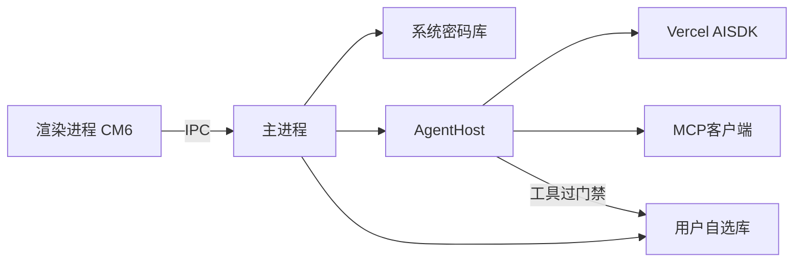
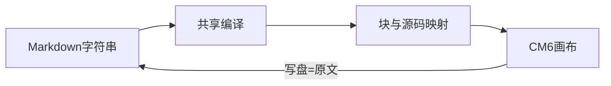

# 架构

本文只写已经拍板的结构。数字、禁令和未锁清单见 [已拍板决定](decisions.md)，此处不提前写死，也不再抄一遍。

## 总览

- **渲染进程：** 画布是 CodeMirror 6。文档是 Markdown 字符串。无 Node，不能直接碰盘。画布只消费编译结果和源码映射，自己不解析结构。
- **主进程：** 打开库、读写文件、权限名单、索引、窗口、系统密码库。`AgentHost` 住在这里。
- **AgentHost：** 一场 `/` 的运行环境。接 Vercel AI SDK 和官方 MCP 客户端。工具过同一套门禁。模型看不到原始文件系统。
- **正文编译：** 共享一条管线（零 DOM、零 CM6）。注册插件 → 解析 → 索引 → 把源码映射交给画布。日后检索、反链、喂模型走同一份结果。细则见 [已拍板决定](decisions.md)。

## 正文管线

- 结构只在这一条管线里解析。不要在画布、检索、Agent 里再各写一套。
- 语法扩展走插件，不改宿主。v0 插件含 GFM、frontmatter、公式、callout、wikilink、mermaid。callout 用 mdast 变换，不是第二套解析。
- 写盘永远是编辑器里的字符串。

## 库内布局

- `.md` 就是笔记。
- 每篇笔记带一个附件夹，名字与笔记同名。图和 PDF 跟这篇走。引用写全路径，解析走 Markdown 标准相对路径。
- 权限名单和技能文件跟库走，对文件树隐藏。
- 账本写在这篇笔记同一个文件里，放在最末尾，用一行机器锚点分隔；正文永远在锚点之前。树上没有单独一条。
- 索引（人搜、反链、日后的模型检索与喂模型）只吃锚点之前的正文，不得看见账本。
- 密钥不进库。只进系统密码库。

## 两套可见范围

- 人的搜索含禁止触碰。
- 模型检索不含禁止触碰。
- 不要做成同一份「看不见」的索引。细则见 [已拍板决定](decisions.md)。

## 一场 `/` 的数据流

1. 人在空段段首按 `/`，口令落在正文。
2. 模型拿到三样：正文、账本、这一次 `/` 落在哪两块之间。
3. 回答先插成未采纳块，接在 `/` 下面。
4. 人点采纳，才跟手写一个样。丢弃则删块。账本原文不动。
5. 工具：建、补当前篇、改名、挪、删。删要人在弹窗点头。
6. 回车、切 tab、点别处自己写，这场散场。未采纳块留在当时那篇里。

## 信任边界

| 对象 | 态度 |
|------|------|
| 库文件夹 | 唯一笔记地盘。第一次必须人选。丢了就回选夹。 |
| 禁止触碰 | 人能打开、能搜到。模型检索没有。MCP 也带不走。 |
| 必须遵循 | 人能改字。模型不能写。涉及就查原文。 |
| 模型 | 不可信。读、写、搜都经工具与门禁。 |
| 联网开关 | 开则可搜网、抓页。关了只查本地库。 |
| MCP | 可选的手。接上之后仍走同一套门。模型不能自己接。 |
| 密钥 | 只在操作系统密码库。 |

相关：[理念](vision.md) · [已拍板决定](decisions.md) · [施工守则](handbook.md)
