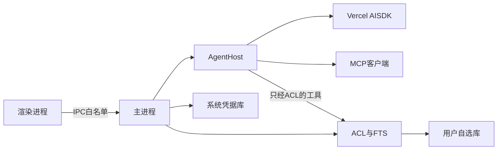

# 架构

本文描述已经拍板的结构。实现细节见 [已拍板决定](decisions.md) 的未锁清单，此处不提前写死。

## 总览

- **渲染进程：** Typora 式编辑器、文件树、快捷键、把流式结果画进正文或幕后区块。无 Node、不能直接碰盘。
- **主进程：** 打开库、读写文件、ACL、索引、窗口、单实例、系统凭据库。`AgentHost` 住在这里。
- **AgentHost：** 模式（改写 / 问答 / 强制检索）、注入 prompt-only skills、调用 AI SDK、把 MCP 与库内工具接到同一张白名单上。模型看不到原始文件系统。

磁盘和三档规则只在主进程执行。渲染进程与模型都只能走工具或 IPC。

## 第一次运行

1. 用户选定一个文件夹作为库（可在非系统盘）。路径记在系统侧小配置里。
2. 若要用 AI：在窗口里保存至少一家厂商的 API Key，写入系统凭据库，不写进库文件夹、不写进 git。
3. 之后日常打开：读配置找到库，列出文件树，打开上次的笔记。无密钥时编辑器仍可用。

## 一次页内 AI

1. 用户在当前笔记里选中文字或按下问答快捷键。
2. 主进程判定模式：改写走 `editor_*`；跨文件整理走 `vault_*`；命中必须遵循领域则先 `vault_search` / `vault_read`。
3. 工具结果经 ACL。禁区、规则目录、必须遵循上的写，直接失败并返回原因。
4. 流式 token 回到渲染进程：替换选区、插入段落、或写入幕后区块。
5. `vault_delete` 弹出确认，用户点头后才删盘。
6. 当前缓冲区与磁盘不一致时，以编辑器工具改窗口，保存仍是用户或明确的保存动作；不要在用户没保存时用 `vault_write` 覆盖整篇。

## 信任边界

| 对象 | 态度 |
|------|------|
| 库文件夹 | 唯一笔记地盘；子路径按三档规则 |
| 库以外的磁盘 | 当不存在 |
| 模型 | 不可信；所有读/写/搜都经工具与 ACL |
| 模型厂商 API | 产品必需的网络 |
| 搜索 MCP | 外网检索；结果仍要过「能不能进当前问题」 |
| 密钥 | 只在操作系统凭据库 |
| 库内规则与 skills 文件 | 人可编辑、可进 Git；AI 不可写规则目录 |

v0 不提供 Shell，避免命令改盘绕过文件工具。

## 数据放哪

- **库：** 用户的笔记、附件、规则文件、prompt-only skills。这是主副本。
- **凭据库：** API Key。
- **系统侧小配置：** 上次打开的库路径、窗口状态。不含笔记正文、不含密钥。

没有单独的「会话库」。对话在对应 `.md` 的幕后区块里。

## 体积与进程

- 不要为每篇笔记开窗口，不要再嵌一层浏览器当阅读器。
- 不要再挂 Python 或第二份 Chromium。
- 重型渲染（公式、Mermaid）按需加载。
- 索引在主进程（或 `UtilityProcess`），不要把整库读进渲染进程。

相关：[理念](vision.md) · [已拍板决定](decisions.md) · [施工守则](handbook.md)
