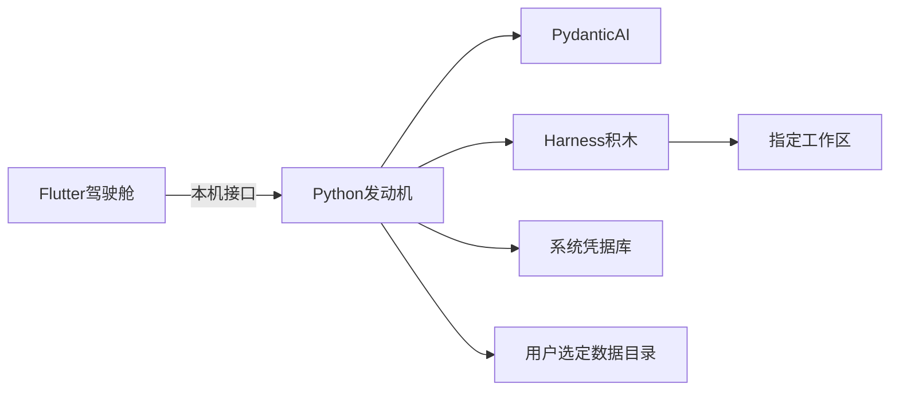

# 架构

本文描述已经拍板的结构。实现细节见 [已拍板决定](decisions.md) 的未锁清单，此处不提前写死。

## 总览

- **Flutter 驾驶舱：** 窗口、工作区与任务列表、写文件过目、收集密钥并交给发动机写入凭据库、联网总闸、第一次选择数据目录。不直接构造模型客户端，不直接写工作区。  
- **Python 发动机：** 按「厂商 + 模型」装配 Pydantic AI；挂上选定的 Harness 积木；把库的流与 HITL 转成驾驶舱能用的过程；读写数据目录里的会话库（含检查点）与配置。  
- **本机接口：** 两个进程之间的合同（任务开始、事件推向界面、用户确认再送回发动机）。形态未锁；原则已锁：薄封装库已有能力，不自研第二套 Agent 循环。  

## 第一次运行

1. 打开驾驶舱，用户选定数据目录（可在非系统盘）。路径记在系统盘上的小指针里。  
2. 用户在窗口里保存至少一家厂商的 API Key；发动机写入系统凭据库，不写进数据目录、不写进工作区。  
3. 用户指定至少一个工作区，并选择厂商与模型。  
4. 之后日常打开：读指针找到数据目录，凭据库取密钥，列出普通会话（含未完成与待确认）。  

## 一次写文件过目

1. 用户在某工作区发起任务。发动机 `run` / `run_stream`。  
2. 读文件等不需过目的动作由积木执行（仍不得越出该工作区）。  
3. 模型要写文件时，工具走 HITL：本次 run 以待确认结束，界面展示拟议内容。  
4. 用户同意或拒绝后，驾驶舱把结果交给发动机，再一次 `run`（带上 `deferred_tool_results` 与对话历史）。  
5. 若在步骤 3 关机：会话库里已有历史与待确认请求；下次打开仍在普通会话里，可继续过目。  

同工作区若已有一个任务在写，其他任务只能读或排队，避免两个过目结果互相覆盖。

## 信任边界

| 对象 | 态度 |
|------|------|
| 用户指定的工作区 | 唯一可动的用户文件范围，可同时多块，各管各的 |
| 工作区以外的磁盘 | 当不存在 |
| 模型 | 不可信；写必须过目 |
| 模型厂商 API | 产品必需的网络 |
| 其它网络 | 默认允许，应用级开关可关 |
| 密钥 | 只在操作系统凭据库，短暂进入发动机内存 |
| 会话库与配置 | 用户选定的数据目录，默认不离开本机 |

v0 不提供 Shell，避免命令改盘绕过写文件过目。

## 数据放哪

- **工作区：** 用户的项目目录。产品状态不准写入其中。  
- **凭据库：** API Key。  
- **数据目录：** 第一次运行用户选择（可在非系统盘）。会话库（含检查点、普通 / 归档 / 删除状态）、配置住在这里。检查点不是第二套散落文件树。  
- **系统盘指针：** 仅记录数据目录路径，体积可忽略。  

普通不过期且须手动归档；进行中与待确认不得被归档清理误伤。归档超限进入删除时，界面要说清原因。

## 并行

- 多个任务可以同时跑。  
- 多个工作区可以同时有各自的写者。  
- 同一工作区：一写多读。  

驾驶舱负责展示多个普通会话；发动机负责按工作区执行写锁。具体锁实现未锁，规则已锁。

相关：[理念](vision.md) · [已拍板决定](decisions.md) · [施工守则](handbook.md)
