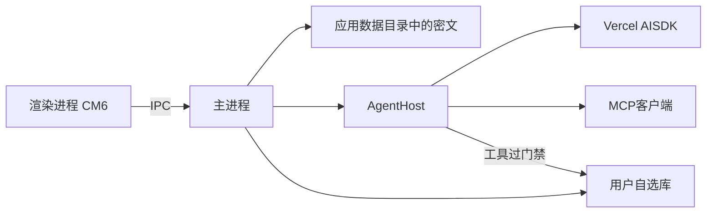
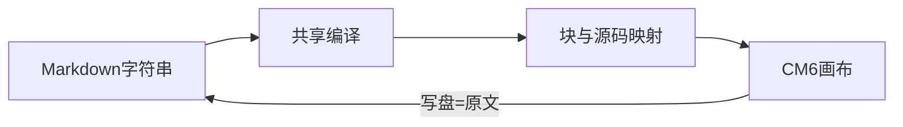

# 架构

本文只写已经拍板的结构，以及这些结构在代码里怎么被强制。数字、禁令和未锁清单见 [已拍板决定](decisions.md)，此处不提前写死，也不再抄一遍。

未开工对象的实现细节写在 [施工图](build.md) 和 [施工对象](topics.md)，不要写进本文装成已有。

## 总览

- **渲染进程：** 画布是 CodeMirror 6。文档是 Markdown 字符串。无 Node，不能直接碰盘。画布只消费编译结果和源码映射，自己不解析结构。
- **主进程：** 打开库、读写文件、权限名单、索引、窗口。v0 的 `AgentHost` 先住在这里，压测后可迁移。
- **AgentHost：** 一场 `/` 的运行环境。愿景 / 选型 / 路线见 [施工对象](topics.md#agent-核心框架)。当前未开工。
- **正文编译：** 共享一条管线（零 DOM、零 CM6）。注册插件 → 解析 → 索引 → 把源码映射交给画布。日后检索、反链、喂模型走同一份结果。细则见 [已拍板决定](decisions.md)。

## 正文管线

- 结构只在这一条管线里解析。不要在画布、检索、Agent 里再各写一套。
- 语法扩展走插件，不改宿主。v0 插件含 GFM、frontmatter、公式、callout、wikilink、mermaid。callout 用 mdast 变换，不是第二套解析。
- 写盘永远是编辑器里的字符串。管线先 `partitionSource`，只编译正文。

## 库内布局

- `.md` 就是笔记。
- 每篇笔记带一个附件夹，名字与笔记同名。图和 PDF 跟这篇走。引用写全路径，解析走 Markdown 标准相对路径。
- 权限名单和技能文件跟库走，对文件树隐藏。权限名单的选定路径见下方强制点。
- 账本写在这篇笔记同一个文件里，放在最末尾，用一行机器锚点分隔；正文永远在锚点之前。树上没有单独一条。
- 人搜、反链与日后的模型检索只索引锚点之前的正文，不得索引账本。Host 组模型上下文时另行读取本篇账本，按 [产品合同 · 喂给模型](decisions.md#喂给模型) 的预算与来源规则处理。
- 密钥不进库。Host 阶段以 Electron `safeStorage` 加密，密文只存应用数据目录，解密材料由操作系统保护。

## 两套可见范围

- 人的搜索含禁止触碰。当前人搜是惰性全量 + 子串，可按压测换引擎。
- 模型检索不含禁止触碰。同一份语料，查询期过滤。方法不与人搜子串绑定。
- 不要做成同一份「看不见」的索引。细则见 [已拍板决定](decisions.md)。

## 一场 `/` 的数据流

1. 人在空段段首按 `/` 输入；回车发送口令并散场，同时把生成任务绑定到发起时的笔记和落点。
2. 模型拿到三类带来源的内容：该笔记正文、按预算处理的本篇账本、这一次 `/` 落在哪两块之间。旧账本章节超限时可用本任务临时摘要，不改原文。
3. 回答先插回原笔记的未采纳块，接在 `/` 下面。切 tab 只结束输入交互，不取消任务，也不改变结果目标。
4. 人点采纳，才跟手写一个样。丢弃则删块。账本原文不动。
5. 工具：建、补发起篇、改名、挪、删。删要人在弹窗点头；权限对来源、目标和受影响子树逐项核验。
6. Esc、停止按钮或关窗取消仍在运行的任务。未采纳块留在原笔记，并记中止原因。

## 信任边界

| 对象 | 态度 |
|------|------|
| 库文件夹 | 唯一笔记地盘。第一次必须人选。丢了就回选夹。 |
| 禁止触碰 | 人能打开、能搜到。模型检索没有。不经应用代转带出。 |
| 必须遵循 | 人能改字。模型不能写。涉及就查原文。 |
| 模型 | 不可信。读、写、搜都经工具与门禁。不另做规划器。 |
| 联网开关 | 开则可搜网、抓页。关了只查本地库。约束的是应用代转。 |
| MCP | 可选的手。只接能代转的。模型不能自己接。关闸或无法代转则不准接。 |
| 密钥 | v0 用 Electron `safeStorage` 加密，密文只存应用数据目录。 |

## 强制点

已拍板性质在哪一层被挡住。没有运行时表面的，不列在这里。

| 性质 | 层 | 现状 |
|------|----|------|
| 渲染进程不碰盘 | 壳 | `contextIsolation: true`、`nodeIntegration: false`、`sandbox: true`（`src/main/index.ts`）。preload 只经 `contextBridge` 暴露白名单（`src/preload/index.ts`）。sandbox 下 preload 必须打成 `out/preload/index.cjs`（`electron.vite.config.ts`）。 |
| IPC 是唯一通道 | 壳 | 通道名和载荷类型在 `src/shared/ipc.ts`。渲染进程不得再开通道。 |
| 不随便开页 | 壳 | `setWindowOpenHandler` 一律 deny。`will-navigate` 一律 `preventDefault`；`http(s)` 走系统浏览器（`src/main/index.ts`）。 |
| CSP | 壳 | `src/renderer/index.html`：`default-src 'self'`；图允许 `data:` 与 `rgent-vault:`。 |
| 媒体不逃出库 | IO | `resolveInVault` 拒绝 `..` 与绝对路径；`rgent-vault:` 经 `SecureVaultFs.readBytes` 从固定库根句柄逐级相对读取，不向 `net.fetch` 传校验后的路径（`src/main/paths.ts`、`vault-protocol.ts`）。 |
| 隐藏路径人写盘写不了 | IO | `writeNote` / `readNote` 拒绝含点号段的路径（`src/main/notes-fs.ts`）。文件树不列出点号名。权限名单、技能文件必须落在这类路径上。 |
| 笔记路径与冲突写盘 | IO | 主进程 Node-API 模块（`native/**`）固定库根目录句柄；macOS 以 `O_NOFOLLOW_ANY` 从根打开完整相对路径，库根临时文件经 `renameatx_np(RENAME_NOFOLLOW_ANY)` 原子提交，防止已打开子目录被搬出后写到库外；Windows 用 `NtCreateFile` 逐级相对打开和 `FileRenameInfoEx`，拒绝重解析点。树、读写、索引和媒体均走 `src/main/secure-fs.ts`，模块缺失不降级。`noteRead` 给全文及内容修订值，`noteWrite` 带预期修订值；同篇应用内串行检查，冲突交给人选磁盘或窗口稿。目录变化以安全元数据扫描发现，不按旧路径建立监听。macOS 搬出子目录的回归见 `test/main/path-race.test.ts`；Windows 写盘尚待 CI 验收。 |
| 权限名单的失效状态 | 主进程 | 名单缺失是空名单；已有名单损坏、无效、无法读取或条目身份不稳是 `invalid`。人读写搜继续，树上提示修复，名单写入只接受经句柄核验的文件夹与三档值并原子替换。权限按文件系统实际路径组成归一，别名冲突与身份变化使 AI 失败关闭。`modelTierFor` 目前仅被测试调用；Host 未接线，尚无实际模型出口。Windows 真实别名与写盘仍待 CI 验收。 |
| 人写盘 ≠ 模型写盘 | IPC | `noteWrite` 只给人的自动写盘与手动保存。`AgentHost` 不得复用这条通道。Host 未开工，这条先当禁令。 |
| 索引不见账本 | 管线 / 索引 | `partitionSource` 切开锚点（`src/markdown/partition.ts`）。`compile` 和 `VaultIndex` 只吃 `body`。 |
| 画布不见账本 | 画布 | Tab 拆 `content`（正文）与 `ledger`（`src/renderer/src/tabs.ts`）。编辑器只 `setText(body)`。写盘 `composeSource`。 |
| 人搜含禁区 | 索引 | `VaultIndex` 是全量语料，建索引时不按权限过滤。当前人搜是惰性全量 + 子串。模型检索尚未开工，未来在查询期过滤。 |
| 退出不丢稿 | 壳 | 关窗先 `flushRequest`。保存失败时主进程原生对话框让人重试、继续编辑或明确放弃；关窗和 `Cmd+Q` 走同一状态流程，重复请求不重复弹框。超时只在渲染进程已死时关。`vault.dispose()` 在 `will-quit`，不在 `before-quit`（退出 flush 还要走 `noteWrite`）。流程测试见 `test/shared/flush.test.ts`；失败弹窗的三条路径已在本机实际复核，本次原生模块构建后窗口已启动并读到笔记。 |
| 密钥不进库 | 主进程 | Host 最小环接 Electron `safeStorage`，密文只存应用数据目录；尚未接线。 |

## 选定值（可迁，不是永久合同）

改这些等于一次扫描或一次迁移，不要悄悄换。

| 项 | 值 | 说明 |
|----|----|------|
| 账本锚点 | `<!-- rgent:ledger:v1 -->` | 整行匹配，取最后一次。围栏见 [已拍板决定](decisions.md) §账本。 |
| 权限名单 | 库根 `.rgent-permissions` | 点号开头，树上看不见，`noteWrite` 写不了。条目格式未锁，本阶段在 [施工图](build.md) 里选定。 |

## 已落地现状

这些是代码事实。人搜当前是惰性全量 + 子串；最多 100 条、排序、片段未写成合同数字。

- **人搜：** 惰性全量重建，下一次查询才重扫。标题与正文子串匹配（小写）。测试：`test/main/vault-index.test.ts`、`test/renderer/search.test.ts`。
- **反链：** 同源索引，吃编译结果里的 `[[全路径]]`。只在打开/切换笔记时刷新，不挂按键，也不挂每次自动写盘。
- **索引脏标记：** 重建开始时清 `dirty`；重建期间再脏就再扫一轮（`VaultIndex.ready`）。
- **换库：** `attach` 时 `index.reset()`，避免新库看到旧库反链。

相关：[理念](vision.md) · [已拍板决定](decisions.md) · [施工守则](handbook.md) · [施工图](build.md) · [施工对象](topics.md)
