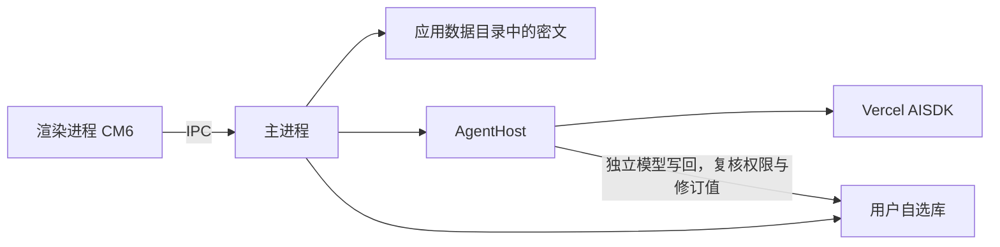
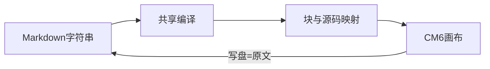

# 架构

本文只写已经拍板的结构，以及这些结构在代码里怎么被强制。数字、禁令和未锁清单见 [已拍板决定](decisions.md)，此处不提前写死，也不再抄一遍。

未开工对象的实现细节写在 [施工图](build.md) 和 [施工对象](topics.md)，不要写进本文装成已有。

## 总览

```mermaid
flowchart LR
  Renderer[渲染进程 CM6]
  Main[主进程]
  Host[AgentHost]
  SDK[Vercel AISDK]
  Vault[用户自选库]
  Keys[应用数据目录中的密文]

  Renderer -->|IPC| Main
  Main --> Keys
  Main --> Host
  Host --> SDK
  Main --> Vault
  Host -->|独立模型写回，复核权限与修订值| Vault
```

- **渲染进程：** 画布是 CodeMirror 6。文档是 Markdown 字符串。无 Node，不能直接碰盘。画布只消费编译结果和源码映射，自己不解析结构。
- **主进程：** 打开库、读写文件、权限名单、索引、窗口。当前可信无工具 `AgentHost` 住在这里，性能迁移仍属工程选型；可执行第三方的安全隔离另有 [开放前置](topics.md#沙箱与任务授权)，不能由性能达标省略。
- **AgentHost：** 一场 `/` 的无工具运行环境。愿景 / 选型 / 路线见 [施工对象](topics.md#agent-核心框架)。最小环已接线；当前已接范围预览和一次性授权，AI 工具仍须等本包验收。
- **尚未接线：** 通用资源代理、第三方执行隔离、MCP 客户端、AI 文件工具、长期记忆和多连接供应商管理不在上图中。未来的数据流先在 [施工图](build.md) 排依赖并通过相应门禁，再更新这里的强制点。
- **正文编译：** 共享一条管线（零 DOM、零 CM6）。注册插件 → 解析 → 索引 → 把源码映射交给画布。日后检索、反链、喂模型走同一份结果。细则见 [已拍板决定](decisions.md)。

## 正文管线

```mermaid
flowchart LR
  Src[Markdown字符串]
  Pipe[共享编译]
  Idx[块与源码映射]
  View[CM6画布]
  Src --> Pipe --> Idx --> View
  View -->|"写盘=原文"| Src
```

- 结构只在这一条管线里解析。不要在画布、检索、Agent 里再各写一套。
- 语法扩展走插件，不改宿主。v0 插件含 GFM、frontmatter、公式、callout、wikilink、mermaid。callout 用 mdast 变换，不是第二套解析。
- 写盘永远是原文字符串。画布内部采用 LF 行结构，`view/source.ts` 保存原始换行并在编辑／源码偏移间映射；撤销、重做与身份操作不整篇归一化。`compile` 一次解析原文后复用树识别顶层独立 v1 账本锚点，只把正文节点交给呈现和索引；代码、引用、列表及 YAML 中的示例不构成边界。
- 保存、另存及 Host 首次追加账本前必须核对组成后的账本分区；正文未闭合的围栏、注释或未分隔的 HTML 块吞入账本时拒绝写盘，保留窗口稿与待存回答并提示修正语法，不自动补写正文。已有账本原文必须仍位于独立账本前缀。
- 整库消失或根路径对象改变时暂停访问并关闭旧目录句柄，保留当前会话、核验快照及 tab，不能沿被搬走的旧句柄继续读内容。根路径 `dev/ino` 存活检查仅补充原生对象核验；原目录恢复后仍逐篇核对原对象，成功读回后恢复监听，换库前仍须处理保稿。

## 库内布局

- `.md` 就是笔记。
- 每篇笔记带一个附件夹，名字与笔记同名。图和 PDF 跟这篇走。引用写全路径，解析走 Markdown 标准相对路径。
- 权限名单和技能文件跟库走，对文件树隐藏。权限名单的选定路径见下方强制点。
- 账本写在这篇笔记同一个文件里，放在最末尾，用一行机器锚点分隔（锚点值见 [已拍板决定](decisions.md) §账本）；正文永远在锚点之前。树上没有单独一条。
- 人搜、反链与日后的模型检索只索引锚点之前的正文，不得索引账本。Host 组模型上下文时另行读取本篇账本，按 [产品合同 · 喂给模型](decisions.md#喂给模型) 的预算与来源规则处理。
- 密钥不进库。Host 阶段以 Electron `safeStorage` 加密，密文只存应用数据目录，解密材料由操作系统保护。
- 库根隐藏 `.rgent-lifecycle` 记录结构操作的身份、修订、权限迁移与恢复进度，不记录笔记正文，不提供历史版本。有效的未完成记录使 AI 访问失败关闭，直至按对象身份恢复；不由程序清空不可信状态。

## 库内文件生命周期

- 人的自动保存、Host 独立写回、权限修改、新建和结构操作由 `VaultSession` 的库内队列串行协调。结构提交开始先阻止本库新任务；无关任务仍在运行时拒绝新结构提交，受影响任务取消并保存输出后，画布再完成脏 tab 写盘。随后封住受影响路径的新写入，并在同一队列中重新核对预览后提交。冲突仍走现有双预览。失败时解除写入闸。
- 预览记录来源与目标、同名附件夹、对象身份、受影响目录、显式权限和全路径引用；提交重新核对，不接受过期预览。原生模块从固定库根核验路径，拒绝链接、重解析点、越界与覆盖；笔记 Markdown 字节在移动本身不变。
- `VaultSession` 为每次挂库生成会话令牌；结构操作等待 Host 和草稿期间、排队后及返回前均核对令牌。恢复完成事件与外部改动带会话归属，换库后的旧预览、旧恢复结果和迟到通知不能用于新库。
- 改名／移动的中断记录先落盘，再逐项搬迁。每项移动后复核目标对象身份；全部目标的类型与文件内容哈希核对通过后，才迁移权限和清除记录。人工确认的引用修复按每篇修订值进行；若修复对象也在移动范围内，记录修复后内容的哈希，以便原子替换改变文件身份后仍能核对并续跑；不记录正文。失败项须显式展示。未完成记录保持门禁关闭。macOS 的路径式原生改名在最后一次身份核对与系统调用之间仍可能受外部换名影响，不能把预检当原子证明；移动后复核用于防止静默报成功，不等于已证明对抗所有并发外部改动。
- 删除必须经 macOS 与 Windows 的系统废纸篓原位恢复和换路径竞态实测。仅接受能证明预览对象身份与原路径保持一致的调用，且须能核对恢复对象与原权限。现有 `shell.trashItem(path)` 接口单凭路径不满足这条证明；入口关闭，不能改用永久删除或库内改名暂存。
- 独立的 [macOS](../test/native/trash_mac.mm)／[Windows](../test/native/trash_win.cc) 废纸篓探针不编入产品，也不提供生产 IPC。`NSWorkspace.recycle` 的路径 URL、文件引用 URL及 `IFileOperation` 的 Shell 对象／删除前回调均已出现对象或库范围反例；Windows 拒绝删除共享的文件句柄同时阻止回收，父目录句柄仍不能封住子文件替换。当前没有可接线的安全删除实现；采证结果及原位恢复缺口见 [施工记录](build.md#9-月-30-日安全与恢复收口)。
- 移动前、每项移动后及完成前重新枚举源／目标子树，核对完整成员、类型、身份和字节；新增、缺失、替换或无法读取均保留恢复记录。隐藏子成员也属于对象集合，不能因文件树隐藏而漏核。合法旧版 v1 记录继续参与核验，损坏或缺乏可证明身份的记录不自动改写。
- `lifecycleStatus` 仅返回当前会话、记录字节修订号、操作和相对路径的逐项状态，以及有限失败码；不返回正文、原始隐藏记录或绝对磁盘路径。`lifecycleRetry` 绑定会话和记录修订，复用停止 Host、保住生成内容、保存草稿和封住结构写入的流程；状态浮层无绕过核验的入口。
- 结构门期间拒绝本库新任务；新提交若有无关活动任务则先拒绝，不主动取消。恢复已有记录时先停止流，并核对待保存任务路径与源、目标、附件及引用修复范围；相交则拒绝，不相交的输出原样留在 Host 内存。恢复核验成功并解除记录门禁后，才走原模型权限与修订值路径补存；失败保留输出，以独立字段说明，不能绕过权限或把它冒充未修复引用。

## 两套可见范围

- 人的搜索含禁止触碰。当前人搜是惰性全量 + 子串，可按压测换引擎。
- 模型检索不含禁止触碰。同一份语料，查询期过滤。方法不与人搜子串绑定。
- 不要做成同一份「看不见」的索引。细则见 [已拍板决定](decisions.md)。

## 一场 `/` 的数据流

1. 人在空段段首按 `/` 输入；回车打开口令旁的授权浮层，显示固定参考对象及模型接收方；再次回车确认后发送并散场，把生成任务绑定到原笔记和落点。输入法组合期间不发送，取消保留口令。
2. 模型拿到三类带来源的内容：该笔记正文、按预算处理的本篇账本、这一次 `/` 落在哪两块之间。旧账本章节超限时可用本任务临时摘要，不改原文。
3. 回答先插回原笔记的未采纳块，接在 `/` 下面。切 tab 只结束输入交互，不取消任务，也不改变结果目标。
4. 人点采纳，才跟手写一个样。丢弃则删块。账本原文不动。
5. 后续工具须经 [统一授权与资源代理](topics.md#沙箱与任务授权)；受信任文件与网络服务在主进程核验执行，第三方代码须另经隔离。具体清单只见 [已拍板决定](decisions.md#工具)。当前只有既有无工具 Host 的单场范围授权，工具和执行隔离尚未接线，删除入口也未开放。
6. Esc、停止按钮或关窗取消仍在运行的任务。未采纳块留在原笔记，并记中止原因。

## 信任边界

| 对象 | 态度 |
|------|------|
| 库文件夹 | 唯一笔记地盘。第一次必须人选。丢了就回选夹。 |
| 禁止触碰 | 人能打开、能搜到。模型检索没有。不经应用代转带出。 |
| 必须遵循 | 人能改字。模型不能写。涉及就查原文。 |
| 模型 | 不可信。当前上下文、模型发送与独立写回经主进程权限及单场授权；未来工具复用相同核验。不另做规划器。 |
| 联网开关 | 未来限制 Agent 搜索／抓页与 MCP；模型文本与图片展示用途各自受控，当前没有联网开关接线。 |
| MCP | 尚未接线。逐候选双平台出口门见 [沙箱合同](decisions.md#沙箱与单场任务授权未来合同当前未开放)，不能只凭白名单认定受控。 |
| 密钥 | v0 用 Electron `safeStorage` 加密，密文只存应用数据目录。 |

## 沙箱边界的现状

文件基础与图片出口保持原门禁。`task-authorization.ts` 已提供仅内存、一次性消费的范围预览；授权绑定当前主 frame、库会话、命令、发起及参考对象、允许动作与模型／上限快照。目录固化为对象集合，提交及后续调用重验权限、身份和修订；只有受控成功写回续接发起篇身份。取消或结束撤销后续模型／读取调用，收尾只能向原篇保住已生成内容并遵守最新写盘门。通用网络代理和第三方隔离仍未接线，完成证据见施工图。

本节区分实际边界与未来规划，不给未接线能力添加强制点。

| 已有边界 | 代码证据与范围 |
|----------|----------------|
| renderer 隔离 | `src/main/index.ts` 的 `sandbox`、`contextIsolation` 与关闭 Node；preload 白名单及渲染层 CSP。保护界面进程，不约束主进程中的 Host。 |
| 无工具 Host | `src/main/index.ts` 注入单场授权、受控 `read`、独立 `write`、权限复核、配置与流；`src/main/agent-host.ts` 不提供工具。主进程仍持有系统权限，没有可执行第三方沙箱。 |
| 文件与出口的现有边界 | 固定库根 `SecureVaultFs`、库内队列、会话及修订核验、秘密留主进程；模型文本与远程图片分别走既有通道。不能据此宣称未来工具已共用完整授权服务。 |
| 尚未成立的边界 | 用于搜索／MCP 的额外外部发送批准、统一工具资源代理、远端 MCP 和 OS 级本机第三方隔离及子进程限额均未接线。合同见 [沙箱与单场任务授权](decisions.md#沙箱与单场任务授权未来合同当前未开放)，方案与验收见 [施工对象](topics.md#沙箱与任务授权)。 |

现有删除安全门失败、文件替换残余竞态与中断恢复义务继续成立；未来进程隔离不能把这些缺口自动标成通过。规划目标图只放在施工对象，实际数据流仍以上方总览为准。

人的文件操作基础已按对应提交验收，当前阶段接入单场授权；废纸篓删除与恢复核验已拆为独立未开能力，原生探针和失败证据不因此改变。默认范围与模型接收方已接入现有 Host；额外外部发送批准及远端只读 MCP 优先规则仍属未来合同，外部文件消失后的防重建和来源失效也须定向核验，不能以阶段名称代证。

## 强制点

已拍板性质在哪一层被挡住。没有运行时表面的，不列在这里。

| 性质 | 层 | 现状 |
|------|----|------|
| 画布装饰只从 StateField 出 | 渲染进程 | 编译结果与装饰由一个 `StateField` 提供（`src/renderer/src/view/editor.ts`），**不能**由 `ViewPlugin` 提供：CM6 禁止插件产生块装饰，表格 / callout / mermaid / 块级公式会抛 `RangeError`，异常再被上层的 `catch` 吞掉，表现成「含表格的笔记点不开、界面毫无提示」。另：块级替换会吞掉紧随其后的行装饰，所以身份标记的 chip 用行内替换。改这里时窗口要各起一次含表格与含标记的笔记。 |
| 未采纳的 AI 块不能改字 | 渲染进程 | 判定是纯函数（`src/markdown/identity-lock.ts`）：锁住标记与 AI 块的范围，字面上的改动一律挡，整段删掉（采纳 / 丢弃）放行；整块删掉时把标记行一起删；在锁定块**下面那行**打字时先补一个断段符并右移光标（Markdown 相邻两行同段，不补的话用户刚打的字会被并进 AI 块、然后被自己锁住）。画布用 `EditorState.transactionFilter` **默认拦下所有改文档的事务**，只放行带 `rgent` 前缀 userEvent 的自家动作——只认 `input` / `delete` 会被移行、拖动搬字、Ctrl-T 换位整批绕过。**不许**用整篇只读冒充。切 tab 的整篇替换要换一份撤销历史（`history` 装进 Compartment 重新配置），否则撤销会跨笔记把上一篇的文本填进当前篇。状态级测试见 `test/renderer/identity-guard.test.ts`（不需要 DOM）。 |
| 渲染进程不碰盘 | 壳 | `contextIsolation: true`、`nodeIntegration: false`、`sandbox: true`（`src/main/index.ts`）。preload 只经 `contextBridge` 暴露白名单（`src/preload/index.ts`）。sandbox 下 preload 必须打成 `out/preload/index.cjs`（`electron.vite.config.ts`）。 |
| IPC 是唯一通道 | 壳 | 通道名和载荷类型在 `src/shared/ipc.ts`；preload 不提供通用 invoke/send。主进程所有 handle/on 经统一包装核验当前窗口、当前主 frame 与精确应用入口（`ipc-sender.ts`）；子 frame、旧窗口或导航后的页面失败关闭。调用方可信不代替参数、会话、对象与业务门禁。 |
| 原文与编辑偏移 | 画布／管线 | `view/source.ts` 保留 BOM、LF／CRLF／CR 与未修改部分的字节；公开编辑器接口使用原文偏移，CM 装饰与事务最终映射为规范行偏移。历史 effect 保留被删除的换行，外部更新不进入人的撤销历史；身份操作直接用原文 edit plan。 |
| 内容与对象同读 | 原生／主进程 | `readSnapshot` 从同一次已打开对象取字节与身份；人的保存与 Host 写回同时带库会话、预期对象和修订。只有原生成功写入回执能建立应用保存的身份后继链；同字节替换也不自动续接。macOS 最后身份复核至改名并非原子 identity CAS，受控测试覆盖与残余窗口须分开记录。 |
| 文件消失保稿 | 主进程／画布 | 单篇提示、树批量变化及写入失败均重核绑定对象；消失、替换或不可读暂停原路径自动保存和任务。最后核验账本与未落盘 Host 全文保留；另存预览绑定草稿、来源依据、待存章节与目标父身份，独占发布后复读方可解除对应内容。正文依据仅在内存有限保留，不是磁盘历史备份。 |
| 图片来源与实际出口 | 主进程 | `image-source.ts` 以同一语法树核验区域、范围、URL、身份和对象版本；不信渲染层身份标签。人的／已采纳 HTTPS 正文可自动，AI 与账本逐图点击，未知草稿只允许明确加载。`remote-image-transport.ts` 使用 Node 直连与固定 lookup，`ipaddr.js@2.2.0` 核所有 DNS 答案及逐跳公网地址；原主机名留给 TLS，禁凭据／Cookie／Referrer。排队和 DNS 完成后连接前重核来源，续接绑定来源摘要与原总预算，换库或失效后不建立下一次连接；已经合法发送的数据不能撤回。 |
| 不随便开页 | 壳 | `setWindowOpenHandler` 一律 deny。`will-navigate` 一律 `preventDefault`；`http(s)` 走系统浏览器（`src/main/index.ts`）。 |
| CSP | 壳 | `src/renderer/index.html`：`default-src 'self'`；图允许 `data:`、`rgent-vault:` 与仅返回验明图片字节的 `rgent-image:`。外链地址由主进程受控图片请求获取，渲染层没有 HTTP/HTTPS 通用出口。 |
| 媒体不逃出库 | IO | `resolveInVault` 拒绝 `..` 与绝对路径；`rgent-vault:` 经 `SecureVaultFs.readBytes` 从固定库根句柄逐级相对读取，不向 `net.fetch` 传校验后的路径（`src/main/paths.ts`、`vault-protocol.ts`）。 |
| 隐藏路径人写盘写不了 | IO | `writeNote` / `readNote` / `readVaultMedia` 拒绝含点号段的路径（`src/main/notes-fs.ts`、`src/main/paths.ts`）。文件树不列出点号名。权限名单落在库根 `.rgent-permissions`，与技能文件一样必须落在这类路径上。 |
| 笔记路径与冲突写盘 | IO | 主进程 Node-API 模块（`native/**`）固定库根目录句柄，树、读写、索引、媒体、目录扫描统一走 `src/main/secure-fs.ts`，模块缺失不降级。macOS 逐级从库根相对打开并用 `O_NOFOLLOW_ANY` / `O_RESOLVE_BENEATH`；Windows 用 `NtCreateFile` 逐级相对打开、`OBJ_DONT_REPARSE` 拒绝重解析点。提交前核对修订值，临时文件建在目标父目录内再原子改名，冲突交给人选磁盘或窗口稿。**提交那一步必须锚回库根**：macOS 靠 `renameatx_np` + `RENAME_RESOLVE_BENEATH`；Windows 在提交前从库根重走一遍父目录（`OBJ_DONT_REPARSE`）并比对其文件身份，只把目标名解析在**核验过的那一个父句柄**上——这样父目录被外部整体搬出库外时提交会失败，而不是落到库外。已打开的子目录被搬出库外、不得改写库外原文的回归见 `test/main/path-race.test.ts`（两平台同一条）。两平台保证口径一致：判不出「仍在库内」就失败关闭，且到核对点为止的外部改动能被发现；核对点之后的替换属已知残余（不报冲突、不弹窗），见 [已拍板决定](decisions.md) §库、文件、窗口。Windows 句柄一律用最宽松共享模式——边界靠句柄相对解析成立，不靠拒绝别人的改名。目录变化以安全元数据扫描发现，不按旧路径建立监听。 |
| 权限名单的失效状态 | 主进程 | 名单缺失是空名单；已有名单损坏、无效、无法读取或条目身份不稳是 `invalid`。人读写搜继续，树上提示修复，名单写入只接受经句柄核验的文件夹与三档值并原子替换。权限按文件系统实际路径组成归一，别名冲突与身份变化使 AI 失败关闭。`modelTierFor` 已是 Host 模型入口的实际门禁；未完成的文件生命周期记录也使它失败关闭。 |
| 一次性单场授权 | 主进程／Host | `TaskAuthorizationRegistry` 绑定调用方、会话、对象、口令和接收方；`agentStart` 不接受无预览启动。未知动作、范围外读取／写回、失效或重放均拒绝；Host 读、发、写共用校验，可信取消保稿不恢复模型授权。 |
| 人写盘 ≠ 模型写盘 | IPC | `noteWrite` 只给人的自动写盘与手动保存。`AgentHost` 不得复用这条通道；Host 阶段建立独立模型入口，并与同篇人的写入串行协调。 |
| 索引不见账本 | 管线 / 索引 | `partitionSource` 切开锚点（`src/markdown/partition.ts`）。`compile` 和 `VaultIndex` 只吃 `body`。身份标记是机器语法，人搜的语料里把它等长填空格（偏移不变）——搜 `rgent` 不该搜到它，片段里也不该出现。 |
| 画布不见账本 | 画布 | Tab 拆 `content`（正文）与 `ledger`（`src/renderer/src/tabs.ts`）。编辑器只 `setText(body)`。写盘 `composeSource`。账本回顾在当前 tab 内临时只读，入口常驻正文画布右上角；返回正文恢复原位置，不占右侧反链。 |
| 人搜含禁区 | 索引 | `VaultIndex` 是全量语料，建索引时不按权限过滤。当前人搜是惰性全量 + 子串。模型检索尚未开工，未来在查询期过滤。 |
| 退出不丢稿 | 壳 | 关窗先 `flushRequest`。保存失败时主进程原生对话框让人重试、继续编辑或明确放弃；**渲染进程活着但不应答**（超时，或计时器触发之后才崩）时也进同一个决策态，文案按「写盘失败 / 没有回应」区分——不能让流程停在 flushing，那会让窗口关不掉、`Cmd+Q` 也被挡住。关窗和 `Cmd+Q` 走同一状态流程，重复请求不重复弹框。`vault.dispose()` 在 `will-quit`，不在 `before-quit`（退出 flush 还要走 `noteWrite`）。流程测试见 `test/shared/flush.test.ts`。 |
| 密钥不进库 | 主进程 | Host 最小环已接 Electron `safeStorage`，密文只存应用数据目录；读取 IPC 仅给保存状态，不回传密钥。 |
| 颜色只有一个来源 | 渲染进程 | 组件一律引用 [前端协议](frontend.md) §语义 token 的角色（`--surface-*`、`--text-*`、`--accent-*`、`--border-*`、`--state-*`、`--ai-*`、`--status-*`）；不在组件里写死色值，也不在 CM6 主题里写死（`src/renderer/src/view/editor.ts` 的主题走 token）。日夜两套值只写在 `src/renderer/src/styles.css` 的 `:root` 与 `[data-theme='night']` 两段里，token 取值用纯 hex，好让对比度测试直接解析。**已知例外**：主进程的窗口外观（`src/main/index.ts` 的启动底色与 Windows 标题栏覆盖层）读不到 CSS token，是同一批值的第二份拷贝，必须与 `--surface-nav` 同步（日 `#f5f6f8` / 夜 `#1d2933`）；改 token 时两处一起改。 |
| 主题不碰文档 | 渲染进程 | 切主题或跟随系统只改 `document.documentElement.dataset.theme` 与 CM6 的 `darkTheme` facet，**不产生事务、不触发保存、不进撤销栈**（`src/renderer/src/theme.ts`）。 |
| AI 前缀是显示层 | 画布 | 提问仅在块首行显示一枚 `>`，回答缩进由行装饰 / 类名产生（`src/renderer/src/view/editor.ts`），**不改写正文**；落盘仍走 `composeSource`，`composeSource` 往返必须逐字节不变。参考图里的前缀不是文件内容。 |
| 浮层只有一个栈 | 渲染进程 | 同时最多一个模态浮层；打开时焦点进入浮层、关闭回到触发元素；模态期间焦点不落到底层，破坏性选项不是默认焦点。实现在 `src/renderer/src/overlay.ts`，搜索（`search-overlay.ts`）、冲突决策（`conflict.ts`）、选库共用它。 |
| 冲突预览不是第二条写盘通道 | 渲染进程 | 冲突决策的并排双预览只读渲染（`src/renderer/src/conflict.ts` + `diff.ts`），仍然只有 `noteWrite` 一条写盘通道；通知只作复核信号，串行处理时重新读盘，选择后再次核对 revision，变化则重新展示（`note-reconcile.ts`）。「听窗口 / 听磁盘 / 继续编辑」复用既有分支，Esc 关闭按「继续编辑」结算。普通搜索不能顶掉冲突决策。 |
| 底栏数据只在渲染层算 | 渲染进程 | 行列与字数由编辑器的 doc、selection 推出（`src/renderer/src/statusbar.ts`），不经 IPC、不落盘；字数只计正文，不含账本与身份标记行。人搜仍用主进程原有索引实现，界面阶段不改索引。 |
| 索引只按渲染层数据算 | 渲染进程 | 标题索引吃 `DocIndex.headings` 的 h1–h3（`src/renderer/src/outline.ts`），当前项由「光标在可视范围内则以光标为准，否则以视口起点为准」推出，不另存状态、不发 IPC。 |

相关：[理念](vision.md) · [已拍板决定](decisions.md) · [施工守则](handbook.md) · [施工图](build.md) · [施工对象](topics.md)
