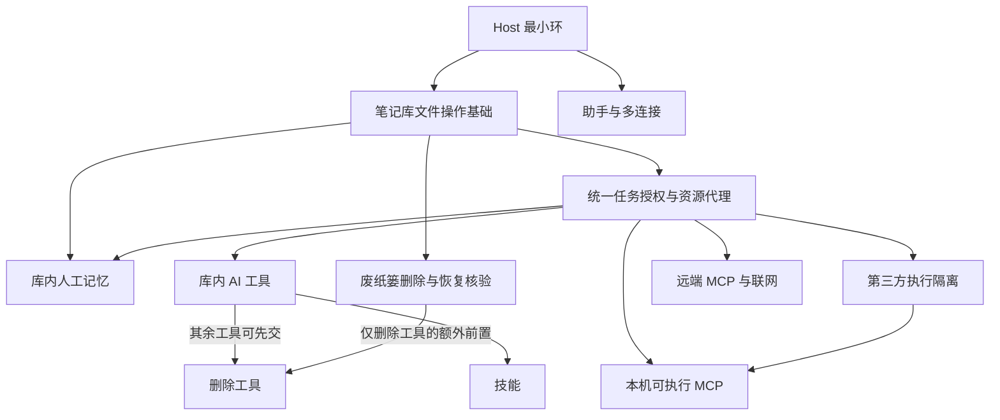

# 施工图

本文不是围栏。过期只改这里，不改产品性格。合同见 [已拍板决定](decisions.md)。强制点见 [架构](architecture.md)。工程题见 [施工对象](topics.md)。编码 Agent 从 [AGENTS.md](../AGENTS.md) 进。

单元格只有三种：

- **已交** — 一行指针。细节在代码和测试里。
- **当前** — 只展开下方那一节。
- **未开** — 禁止写代码。不要把实现写进围栏篇。

换阶段：改「当前阶段」标题、改矩阵里那一格、改 `AGENTS.md` 硬停。不要一次展开下一阶段。

## 当前阶段

**统一任务授权与资源代理。** 文件操作基础按已有对应提交及本次定向复核验收；先将现有无工具 Host 接入一次性单场范围及模型接收方确认。本包验收前不接读库、搜库；废纸篓、写类工具和第三方隔离继续未开。前端冻结与 Windows 原生控制件人工核对独立待核，不表示视觉通过。
### 9 月 29 日进度校准

- **Host 最小环已交功能**：`0e0ca28`、`666f1b0` 已实现配置、密钥加密、无工具流式写回、停止与账本回顾；其后阶段不因此开放工具或联网。
- **设置已交三页功能**：「界面／模型／运行」和阅读偏好可用；视觉仍冻结，待用户对实际画面确认。对应设置的本机验证、既有双平台 CI 与原生窗口记录见下方「界面改造」交付记录，不算本阶段的验收。
- **人的文件生命周期在施工**：`50822fa`、`cfdecb4`、`36a6168` 已包含新建、改名、移动、引用修复与中断恢复路径；人的操作和 Host 写回有协调。系统废纸篓删除入口仍关闭，本阶段不得标「已交」。
- **证据边界**：本机检查、双平台 CI、构建后真实窗口、用户视觉确认是四种不同证据。本次校准的起点上，`36a6168` 与 `439c925` 只在本地分支、比 `origin/branch-v0.1.0` 多两个提交；推送和对应 CI 成功前，不把它们记为远端已验。Windows 原生移动、废纸篓原位恢复及并发换路径安全门尚未取得完成证据。

### 9 月 30 日安全与恢复收口

- 先前的本地提交已推送；提交 `0367ad7` 的 [CI 36648239921](https://github.com/skahanium/Rgent/actions/runs/36648239921) macOS、Windows 两腿成功，包含原生模块装载／路径测试、全量测试及构建后的两种自动化窗口检查。这是既有移动操作的自动化证据；本轮结果另列下方，不混用。
- 本轮补库会话绑定、完整子树复核、可查看的中断状态及绑定记录修订值的安全重试；错误或成员变化保留记录和 AI 失败关闭，不能强制销账。
- 新结构提交与本库无关运行任务互斥；已有恢复记录只允许未相关的 Host 待保存内容留在内存，恢复后按原门禁补存，受影响内容未保存仍阻止。失败／成功重试的焦点、状态入口隐藏后的返回位置和迟到读盘响应均须定向核对。
- [原生废纸篓探针](../scripts/probe-trash.mjs)只处理专用临时库，不编入生产模块。macOS 本机与 CI 七场均完成采证；[NSWorkspace.recycle](https://developer.apple.com/documentation/appkit/nsworkspace/recycle%28_%3Acompletionhandler%3A%29?language=objc) 的路径 URL 在预检后替换文件／父目录／链接时回收替身，文件引用 URL 能追随移到库外的原对象。两种候选均未证明「核验对象、实际对象及固定库根一致」。
- Windows 的 [IFileOperation](https://learn.microsoft.com/en-us/windows/win32/api/shobjidl_core/nn-shobjidl_core-ifileoperation)十四场已在 CI 执行；文件／父目录／junction 在排队后或 `PreDeleteItem` 成功核验后被替换，实际回收对象仍可成为替身。父目录的拒绝删除共享句柄不阻止子文件替换；文件自身拒绝删除共享则使回收失败，不能把锁住对象等同可用安全回收。普通、同名及逐项失败的回执均已核对；只按精确回执取回自己的对象，所有自建文件的身份和哈希均核对后才清理夹具。**两平台候选安全门均未通过**；取回夹具不代表系统“放回原处”或原名、原目录元数据已验收。
- 恢复兼容使用原 v1 记录；ASCII 大小写别名须有唯一记录对象、目标身份和字节、原父路径与完整权限映射证据。歧义、非 ASCII 别名缺乏证据或损坏记录均保留，不自动推断迁移。
- 本机本轮 `docs:check`、`pnpm test`（47 文件，387 通过／2 条件跳过）、`pnpm build`、构建后 `ui:check`（98 项）通过；另跑固定展示笔记及原生 macOS 截图检查（32 项），未重复改视觉。
- 本轮提交 `12f2e1e` 的 [CI 36658675837](https://github.com/skahanium/Rgent/actions/runs/36658675837) macOS、Windows 两腿成功，含构建、原生模块装载／路径测试、全量测试、两种构建窗口检查及独立探针。早先 Windows 探针的编译脚本引号和短路径比较错误已修正；最终报告核对了全部七／十四场及夹具回收，不把先前未执行的场景记为已验。
- 人工已核对两平台的恢复进度窄窗和损坏记录画面、macOS 日夜原生窗口截图及 Windows CI 的日夜原生控制区截图；焦点和键盘行为另由真实窗口断言覆盖。Windows 原生控制件点击、两平台系统“放回原处”及原权限回放尚无人工完成证据。前端冻结与用户视觉确认状态不变。
- 当时删除生产入口和 IPC 保持关闭，整个生命周期阶段按旧边界保持「当前」。下方三项讨论已调整阶段拆分，候选失败结论仍成立。跨卷、网络盘、文件提供者等未证明场景不支持；不以绿灯或探针清理成功替代对象身份、库根约束和原位恢复证明。


### 文件基础与既有出口收口（本轮）

此轮实现上述必要基础接口，不切入任务授权代理，不解除前端冻结，不开放废纸篓或第三方能力。以下证据对应代码提交 `9ce6ab1`；不沿用旧 CI 代证。

| 问题 | 修复强制点 | 定向证据 | 平台与窗口证据 |
|------|------------|----------|----------------|
| 混合换行、编辑与原文位置错位；机器分区伪标记 | 原文 StateField／历史 effect、原文范围映射、单树分区和流式标记转义 | `editor-source`、`pipeline`、`identity-edit`、`host-source`；含 BOM／CRLF／CR／未闭合标记 | 本机与对应双平台 CI 原文／构建窗口链路通过 |
| 权限预览跨两次读取、附件归属与修复范围失真 | 一次权限快照、有效规则投影、完整计划比较、AST 目标子范围 | `vault-lifecycle-service`、`vault-lifecycle`、`path-race` | macOS 与 Windows 对应提交原生／权限定向通过；已知最终改名窗口保留 |
| 同路径替身接走草稿或 Host；消失内容无明确出口 | 同读对象版本、会话和成功保存回执后继；缺失状态／另存预览、独占发布与复读、逐任务确认 | `vault`、`save-copy`、`agent-host-binding`、`host-object` | 两平台固定库完整链路通过，含消失不重建及另存原文字节 |
| 仅部分 IPC 检查 sender | 当前窗口＋当前主 frame＋精确应用入口统一包装 | `ipc-sender`、`ipc-guard` | 错误调用方定向及两平台实际 preload 调用通过 |
| AI／账本自动外发、DNS 检查后另行解析 | 主进程源码证明、逐图点击、来源绑定续接、所有候选公网／固定连接地址、逐跳核验 | `image-source`、`remote-image`、`remote-image-transport`、`remote-image-widget`、`read-only-markdown` | 受控响应已过；不依赖公网，不代称第三方沙箱已交 |

本轮本机 `pnpm docs:check`、`pnpm test`（54 文件、540 通过／2 条件跳过）、`pnpm build` 和构建后 `pnpm ui:check`（113 项）通过。窗口初次回归发现旧文件树刷新会关闭消失的干净 tab，已修为保留并复核；另修恢复期间仅允许日志范围内干净 tab 通过草稿排空，脏稿及无关缺失稿仍阻止提交。固定展示笔记及原生 macOS 日夜窗口截图检查另有 32 项通过；窗口控制区与设置已人工查看。新增来源查看导致行内图片占位换成两行的回归已收紧至 24px，完整地址仍可展开查看。代码提交 `9ce6ab1` 的 [CI 36676587998](https://github.com/skahanium/Rgent/actions/runs/36676587998) macOS、Windows 两腿 success，包含构建、原生装载／测试、完整功能窗口及固定展示窗口。此前 `7b8d28f` 两腿均只在图片提示高度的展示检查失败，已修后重验，不抹去首次失败证据。Windows 构建后窗口由实际 Electron／CDP 流程验证；原生控制件人工点击仍未核实。已人工对照最终两平台的保稿／另存预览／恢复窄窗截图，以及本机 macOS、CI Windows 日夜原生控制区截图。Windows runner 桌面为 `1024×768`，宽布局和控件行为另由 CDP 量测；截图不能代称原生控件人工点击。前端用户视觉确认保持冻结。

明确保留的边界：原生最后身份复核到系统改名仍有外部并发窗口；另存的父目录核验不是原子预览对象 CAS，若发布后父身份变化则明确失败、保留已创建文件及原稿，不解除待保存内容。Host 的最后来源／权限复核至模型 socket 发出也不是 OS 原子授权；发现失效停止后续读写及请求，不能追回已合法发送的字节。定向反例与事后复核用于避免错误续接及静默报成功，不写成已证明所有竞态已阻断。

另存保持原正文、最后核验的账本，并以原任务 ID 保存未落盘完整回答／状态／中止原因；不复制附件、不修相对引用、不重启任务。新建后的 readback 失败时保留原窗口稿和 Host 未保存状态。坏记录仍保留，不提供强制完成或删除回退。

#### 交付后自查修复

| 实际反例 | 修复 | 新证据 |
|----------|------|--------|
| 未闭合围栏／注释、未分隔 HTML 块吞入已有或首次新增账本 | 保存、另存与 Host 追加核对独立账本及原账本前缀；拒写不清稿、不补改原文，给出修正提示 | `save-copy`、`host-source`；真实窗口拒写后撤销恢复、磁盘账本未变 |
| 整库移走清快照／干净 tab；同名替身入口污染目录缓存；恢复早于轮询使监听失效 | 库根存活检查覆盖树、索引、权限、读写、结构、附件及 Host；统一停监听和关缓存，保留会话／稿件，原库恢复后逐篇核验并重建监听 | `vault`、`watch`；真实窗口保稿、旧句柄拒读、恢复重核验，已查看 `vault-missing-retained` 截图 |
| `ipaddr` 将本地翻译及旧 site-local 等 IPv6 判为 unicast | 图片只接受普通全球单播 IPv6，补特殊前缀过滤，所有 DNS 候选均须成立 | `remote-image` 受控混合候选零请求；无真实 NAT64 网络现场验证 |

本机最终 `pnpm test` 为 54 文件、563 通过／2 平台条件跳过；`docs:check`、构建和构建后真实窗口 117 项通过。先复现反例，再修复；独立只读复审发现的库根入口和监听恢复遗漏均补齐并再次复核。修复提交 `a05648f` 的 [CI 36681293949](https://github.com/skahanium/Rgent/actions/runs/36681293949) macOS、Windows 两腿成功，包含构建、原生装载／测试、完整功能窗口与固定展示窗口；不沿用 `9ce6ab1` 的通过证据。阶段仍为当前，Windows 原生控制件人工点击和用户视觉确认状态未变。

### CI 按变更分层

`Verify` 改为文档轻检查、代码双平台门禁、按需视觉采证及独立探针；具体触发、去重、取消与阶段完整验收规则统一见[施工守则](handbook.md#ci-分层)。工作流与分类器自身变更仍触发双平台代码和视觉门，后续纯进度记录不重复编译产品；不改变当前阶段或任何产品安全门。

本机分类与汇总 17 条定向用例、文档检查器 8 条用例、`docs:check`、actionlint 及差异空白检查通过。本次未改产品代码，不在本机重复全量产品测试。工作流提交 `a804321` 的 [CI 36684477502](https://github.com/skahanium/Rgent/actions/runs/36684477502) 已实际运行：文档、macOS／Windows 代码及视觉门、`CI gate` 均成功；无关废纸篓探针跳过。此前代码提交 `a05648f` 的基础验收证据保持独立。默认分支 `master` 尚未合入本次工作流，手动三种模式及开放 PR 的去重场景尚未现场运行，分类／汇总规则已有定向证据；不自动改默认分支或把未运行场景记为通过。

### 本轮进入条件核验

基线 `921cd6f` 无未提交代码。基础代码仍为 `a05648f`，其后仅文档及 CI 分层变更；对应双平台 CI 和构建窗口记录见上表。已通过 GitHub API 复核 `a05648f` 对应 CI `36681293949` 两平台均 success。本次另跑原文、账本、安全另存、Host 对象绑定、IPC 调用方、图片固定连接及生命周期七个定向文件，84 项通过；`docs:check` 通过。不重复整轮基础建设。Windows 原生控制件人工点击、用户视觉确认及废纸篓失败门分别保留，不借阶段切换销账。

## 依赖顺序

无日期。下面列出施工路标；真正不可跳过的前置关系见分支图和交接表，不能把所有能力误读成逐项串行，也不能据此同时开放多个阶段。

```text
笔记壳能启动
  → 管线与画布
  → 账本缝与人搜
  → 门禁
  → 身份标记（含账本只读回顾）
  → 界面改造（前端协议落地）
  → Host 最小环（最小模型配置 + 密钥存储 + 运行上限设置入口 + 流式未采纳 + 取消，无工具）
  → 笔记库文件操作基础（人先用，保存、结构操作与中断恢复）
  → 统一任务授权与资源代理（读写范围、发送确认、撤销、文件与数据出口）
  → 库内 AI 工具（逐件开放，清单见 decisions.md §工具）
  → 助手与多连接（设备习惯、连接隔离、默认模型与单场覆盖）
  → 库内人工记忆（来源核验、权限失效、人工确认与任务调用）
  → 技能
  → 远端 MCP 与联网（受控 HTTPS，先只读查询和资料获取）
  → 第三方执行隔离（可执行组件的双平台资源边界）
  → 本机可执行 MCP（逐候选验证，不提供通用命令执行）
  → 废纸篓删除与恢复核验（独立安全门，不阻塞无删除的能力）
  → 专项模型分工（只随摘要、视觉理解、联网搜索等真实能力开放）
  → 最终视觉与压测校准
```

后续关键交接存在分支，以下仅画前置关系，不代表运行时已经接线：



施工路标不作为连续施工命令。Host 已兑现 [Agent 上下文与历史](topics.md#v0-上下文与历史) 的预算和临时摘要；多连接、人工记忆与 [沙箱授权](decisions.md#沙箱与单场任务授权未来合同当前未开放) 的产品规则已定，工程接口和验收仍待对应阶段开放。废纸篓是独立分支，只阻止删除能力；远端只读 MCP 优先于本机可执行 MCP，前者须过本地出口与数据授权门，后者另过执行隔离门。第三方隔离研究可以提前，不据此启动服务器。多轮、自动提取记忆、子代理与多代理尚未拍板。

### 跨能力交接

下表的「阶段」须在上方施工路标列出；分支图展示关键强制前置，具体开放门以本表和硬约束共同核对，不能把删除分支读成所有工具的前置。合同在 [已拍板决定](decisions.md)，未决工程题在 [施工对象](topics.md)；交付物经代码与验收证明后才可供下游使用。未来设置页随所属能力开放，最后的视觉校准独立进行，不把所有设置功能推迟到最后。

| 阶段 | 前置能力 | 交付给下游 | 开放门与验收证据 |
|------|----------|------------|------------------|
| Host 最小环 | 身份标记、门禁、模型密钥 | 无工具任务、配置与运行上限快照、账本任务章 | 已交：受控流服务、冲突与取消定向测试；厂商现场调用不能由假服务代证。 |
| 笔记库文件操作基础 | Host 取消和保存、固定库根 IO | 人的结构操作、对象身份、权限迁移与中断恢复 | 已交：对应 `a05648f` 双平台测试、构建窗口及本次定向复核；残余竞态如实保留，删除不在本格完成定义。 |
| 统一任务授权与资源代理 | 人的文件操作基础验收、Host 任务及库会话、权限与凭据边界 | 可撤销的单场读写范围、选定模型接收方核对、逐用途发送确认及资源核验 | 当前：先接既有 Host，默认读取发起篇／本篇账本，扩展须人确认；范围、来源、模型接收方、撤销、并行及在途收尾，详见 [门一](topics.md#两道开放门与定向验收)。 |
| 库内 AI 工具 | 对应人的文件操作验收、统一任务授权与资源代理 | 逐件开放的受控读写及可核对结果 | 未开：来源／目标／附件／子树／权限逐件核验，读库／搜库只返回本场范围内信息；删除另等独立安全门和逐次确认，不借修引用改其他篇正文。 |
| 助手与多连接 | Host 配置与任务快照、设备密钥存储 | 设备级助手习惯、多连接凭据隔离、默认模型及单场覆盖 | 未开：跨库习惯、密钥不串用、任务启动后配置固定和错误不静默回退。 |
| 库内人工记忆 | 文件身份与权限迁移、Host 上下文预算、受控数据出口 | 库隔离的记忆记录、来源状态及受控任务读取 | 未开：选取／预览／确认／删除、来源改动与迁移、权限收紧和跨库隔离均须验收；记忆不能扩大任务授权或借失效来源副本流出。 |
| 技能 | Host 工具环、库内受控文件 | 经人加载的库内说明文 | 未开：半成品不加载，模型不能上架或改写技能。 |
| 第三方执行隔离 | 统一资源代理、任务撤销／预算、平台机制与签名方案 | 可验证的最小文件／网络／进程权限和资源上限 | 未开：机制依据及两平台构建后恶意组件实测；失效不得普通启动补位。候选 API、限额和适配未锁，详见 [门二](topics.md#两道开放门与定向验收)。 |
| 远端 MCP 与联网 | 统一授权、受控出口、联网总闸与连接凭据 | 经逐项审定的只读外部能力与低信任结果 | 未开：先远端 HTTPS 查询／资料获取，不下载服务器或挂库；逐项核发送确认、目标认证、数据／凭据隔离、取消和部分失败，两平台本地出口均须证明。内置搜索／抓页独立验收，不声称约束远端内部。 |
| 本机可执行 MCP | 统一授权、第三方执行隔离、候选程序审定 | 有最小资源权限的本机能力 | 未开：逐候选核双平台文件／网络／凭据／进程／资源边界；失效不普通启动补位，不开放任意命令。 |
| 废纸篓删除与恢复核验 | 文件操作基础、原生候选的双平台安全证明 | 人的逐次删除、系统原位恢复核验；随后才供删除工具使用 | 未开：固定库根内实际对象一致、系统保留原名／原目录、部分失败及恢复原权限均须实测；已有候选失败，不提供生产入口或永久删除替代。 |
| 专项模型分工 | 对应摘要、视觉理解或联网搜索能力已开放 | 仅对应能力的模型选择和可信用量数据 | 未开：逐项验证协议及来源统计，不预设小／大／视觉模型控件。 |
| 最终视觉与压测校准 | 各已开页面和长文固定样例 | 统一外观、可访问性与性能证据 | 未开：两平台真实窗口、用户视觉确认与长文延迟记录；不代替功能门。 |

硬约束：

- 门禁早于 AgentHost。
- 身份标记早于 Host 最小环。
- 界面改造早于 Host 最小环：底栏任务位、联网状态位、冲突双预览与浮层焦点是 Host 要往里填的前置。
- Host 最小环早于笔记库文件操作基础；已验收的基础早于统一任务授权与资源代理，后者早于对应 AI 文件工具。删除独立验收，不阻塞无删除的工具或其他已过各自门禁的能力，也不能借此注册删除工具。对象身份与权限迁移早于库内人工记忆，受控记忆读取早于把记忆加入任务上下文。
- 多连接先证明凭据隔离和任务快照，再逐种开放新协议。专项模型分工只随真实的摘要、视觉理解或联网能力开放。
- 搜库工具晚于最小环；方法不与人搜子串绑定。
- `partition.body` 早于一切索引（已满足）。
- 可执行第三方无论性能如何，接线前都必须通过执行隔离；远端 MCP 优先接只读服务，仍逐候选证明双平台本地出口。只迁进程、列白名单或 CI 成功不能代证，无法证明则不接；远端内部不在本机隔离承诺内。
- 任务范围授予后仍逐次核验；默认只读发起篇和本篇账本，读库范围、结构来源／目标与对外发送用途分别确认，扩展由人批准，删除另逐次确认。配置快照不冻结权限，记忆、技能或 MCP 结果不能扩大授权。
- 沙箱门不替代 renderer 隔离、文件身份／修订与恢复门；当前原生废纸篓失败结论、残余竞态和前端冻结状态保持原记录。
- 账本缝已经先于身份标记落地。不要写成「块模型早于账本」。

### 沙箱规划入库与冲突裁定

本轮仅修文档及文档检查器；没有新增产品运行时入口、工具、执行进程或设置页。当前阶段不变，两项沙箱建设均标「未开」。产品结论在 [沙箱合同](decisions.md#沙箱与单场任务授权未来合同当前未开放)，工程职责、候选和验收在 [施工对象](topics.md#沙箱与任务授权)，[架构](architecture.md#沙箱边界的现状) 仅校准实际状态。

| 旧表述或缺口 | 本轮裁定及理由 |
|--------------|----------------|
| 其他可参考笔记可改名／移动，未写本场授权 | 加上人的单场来源／目标范围。范围内可连续执行，但不放宽三档权限、其他篇正文边界或删除确认；库级可参考不足以表达任务意图。 |
| MCP 靠白名单和应用代转；子进程 socket 被描述为应用无法约束 | 白名单是审定步骤，还须资源代理及双平台出口证明。可执行组件直接出口受 OS 隔离约束；无法证明就关闭，避免把已知绕行出口视为允许的残余。 |
| 原生代码唯一例外限库 IO | 扩为最小原生安全边界例外，允许未来隔离在 TS 无法提供 OS 强制点时使用平台适配；机制与双平台验证先行，业务仍用 TS，不授权通用执行或新业务运行时。 |
| Host／索引迁出主进程只由性能决定 | 可信 Host 与索引的性能迁移仍是工程选型；可执行第三方隔离成为独立的安全前置，即使性能正常也不能省掉。 |
| 联网关闸时“只查本地”“最小环无联网”容易包含模型 API 和图片 | 明确关闸限制 Agent 搜索／抓页及 MCP；模型文本、图片展示分别授权。当前最小环确有模型请求，不能被记录为完全离线。 |
| 工具接线直接排在人的生命周期之后；安全说明存在旧实现用语 | 当时插入统一任务授权与资源代理、第三方执行前置，并保留整阶段删除门。后续经用户讨论确认，删除改为独立未开能力，详见下节；既有媒体／取消等证据记录不改变。 |

控件布局、授权令牌格式、平台 API／依赖、签名方案与数值限额仍未锁，不因裁定写成已实现。没有新增独立专题或 ADR。

自查补充：依赖关系改用分支图与交接表表达，内置联网不被误绑到第三方执行隔离；合法保存／移动可核验地续接身份但不能扩权。补齐调用主体校验、第三方工具参数映射、重试与子孙进程共享预算，以及撤销后的在途请求和安全收尾边界；已发送数据不能承诺追回。这些是既定安全原则的工程细化，不开放新能力或更改当前阶段。

文档验证中发现既有检查器把行内代码中的三反引号误认成围栏，导致新章节锚点被吞；本轮仅修围栏识别，并补 CRLF 行内示例／真实代码块的两条回归用例及夹具所需的现有链接文件。文档检查与八条检查器定向用例通过，不运行无关的产品全量测试；这不提供沙箱运行时或双平台安全验收证据。

### 三项讨论后的规划调整

经用户逐项确认，本次只同步文档、阶段名称与检查器用例，不开新功能，不补记运行时通过证据：

| 原规则 | 确认后的规则及影响 |
|--------|--------------------|
| 删除门未过，整个文件生命周期不能结束 | 当前改为「笔记库文件操作基础」，仍须收口自己的安全与恢复缺口；废纸篓删除／恢复核验独立未开，原安全标准和失败反例保留。删除不是其他能力的统一前置，完整生命周期也不能提前报交付。 |
| 可参考笔记均可检索，相关片段默认可联网 | 默认只读发起篇与本篇账本，跨篇读取由人授权；核对选定模型接收方。受本地上下文影响的搜索／MCP 请求须另展示内容、目的地、用途并确认；派生文本和记忆不豁免。 |
| 主要以 stdio 服务器描述 MCP，库内与外部工具混为总数七件 | 首批远端 HTTPS 只读 MCP，执行隔离成立后再逐项接本机服务器。七件是库内文件工具的规划清单，外部能力另审定，删除不与其余工具捆绑交付。 |

已发现但本次未修的代码问题仍须定向复核，尤其是原文／换行保真、机器标记与账本分区、权限预览一致性、IPC 调用主体、图片 DNS 与 AI 输出触发请求的边界。现有 CI 绿灯不使这些反例自动销账；基础阶段仍是「当前」，外部消失后的防重建及恢复失效也须有独立证据。

本次本机 `pnpm docs:check` 与文档检查器八条定向用例通过，阶段名称、当前矩阵行、路标交接及相对链接已核对。仅更新文档和对应阶段用例，未运行产品全量测试，也不新增运行时、双平台或远端 CI 通过记录。

## 对象 × 阶段

对象按代码地盘切。

| 对象 | 代码地盘 | 阶段状态 | 已有能力与待核门禁 |
|------|----------|----------|--------------------|
| 壳与信任 | `src/main/index.ts`、`src/preload`、`src/shared/ipc.ts`、`src/shared/flush.ts` | **已交** | `test/shared/flush.test.ts`；preload 为 `index.cjs`。 |
| 库与文件 | `src/main/vault.ts`、`secure-fs.ts`、`notes-fs.ts`、`vault-lifecycle.ts`、`native/**` | **已交** | 保存、新建／改名／移动／引用修复／中断恢复及消失另存基础已验；残余竞态与废纸篓独立门保留。 |
| 废纸篓删除与恢复核验 | 尚无生产实现；`test/native/trash_*` 仅为探针 | **未开** | 候选失败、删除入口关闭；不因基础阶段改名或外部系统删除而视为已交。 |
| 正文与画布 | `src/markdown/**`、`src/renderer/src/view/**` | **已交** | 一条管线 + viewport widget；`test/markdown/pipeline.test.ts`。 |
| 账本缝 | `src/markdown/partition.ts`、`src/renderer/src/tabs.ts` | **已交** | 画布只吃正文，写盘 `composeSource`。 |
| 检索 | `src/main/vault-index.ts`、`src/renderer/src/search.ts`、`backlinks.ts` | **已交** | 人搜惰性全量 + 子串；模型检索尚未开放。 |
| 门禁 | `src/main/permissions.ts`、IPC、树 | **已交** | 三档名单、树徽章与右键改档；`test/main/permissions.test.ts`。 |
| 身份标记 | `src/markdown/identity*.ts`、`src/markdown/syntax/identity.ts`、`src/renderer/src/view/*` | **已交** | 标记进管线、未采纳块受锁、账本只读；`test/renderer/identity-guard.test.ts`。 |
| 界面改造 | `src/renderer/**`、`src/renderer/src/styles.css` | **已交** | 功能已交，视觉及图片差距冻结待回访；用户画面确认未过。 |
| 一场 `/` | `src/main/**` 的 `AgentHost`、模型配置、IPC 与画布 | **已交** | 仅无工具最小环；厂商现场调用与后续工具不得冒充已验。 |
| 任务授权与资源代理 | Host、库会话、IPC 与安全 IO | **当前** | 正在接入固定范围、一次性预览、模型接收方及撤销；通用网络与第三方执行仍未开。 |
| 第三方执行隔离 | 尚未；平台机制与最小适配待验证 | **未开** | 双平台机制及恶意组件实测是接入门；普通子进程不是完成证据。 |
| 技能 | 尚未 | **未开** | 无页面施工许可。 |
| 远端 MCP 与联网 | 尚未 | **未开** | 先只读 HTTPS，受控出口、数据确认及逐候选双平台门已规划，没有接线许可。 |
| 本机可执行 MCP | 尚未 | **未开** | 另须第三方执行隔离及候选验收，不以普通子进程补位。 |
| 设置 | `src/renderer/src/settings.ts`、本机偏好与 IPC | **已交** | 仅「界面／模型／运行」三页及阅读偏好；视觉待用户确认，未来页面未开。 |
| 助手／多连接／记忆 | 尚未 | **未开** | 未来规则已写合同，接口、页面和任务接线均未交付。 |

矩阵里的“已交”指功能与安全边界，不表示外观已经跟上 [前端协议](frontend.md)。界面遗留差距仍冻结，本轮只增加文件树所需的操作与预览；这些差距不能由本轮自动销账。

## 统一任务授权与资源代理

先交现有无工具 Host 的单场授权，再开放两项只读工具。预览绑定调用方、库会话、发起对象、参考对象、命令与模型配置；提交重验且一次性消费。默认发起篇正文及本篇账本，目录固定展开为 Markdown 对象集合，禁止触碰不可授权，必须遵循只读。

开放范围仅为授权预览、口令旁浮层和 Host 读取／模型发送／发起篇独立写回的共同校验。取消与结束撤销后续调用，可信保稿收尾仍受最新权限、对象与修订门禁；图片许可不扩大为任务网络许可。

完成门：伪造／过期／串场／重放拒绝，接收方或来源改变须重新确认，输入法不误发送，取消后不再调用，既有保稿成立。对应证据随后登记；包验收后另改围栏才可接读库／搜库。

## 笔记库文件操作基础（已交）

本阶段把人的保存、Host 已有写回与库内结构操作接到同一条可复核的路径。入口是文件树的人用新建、改名和移动；删除／系统恢复核验不在本阶段交付，独立门见上方交接表。改阶段名是明确交付范围，不是宣称已有基础验收完成。

### 碰这些

- 本轮安全收口另开放：原文与编辑坐标适配、账本锚点与模型保留标记、权限一致快照、读取与写回对象版本、消失／替换状态及明确另存、统一 IPC 调用方和现有图片出口校验。先补定向反例，再修实现；不借此建设通用授权代理或重开视觉。
- 消失笔记另存保留窗口正文、最后核验的账本，并把 Host 未落盘的完整回答追加到新笔记账本。新目标须未占用，发布后复读核验才解除相应未保存状态；不复制附件或改写相对引用，预览明确提示。
- 自查补口：正文编辑吞入账本锚点时拒绝保存／另存；Host 首次追加也须证明账本仍独立。整库消失或根对象变化保留干净及脏 tab、账本快照和会话，关闭旧句柄，提供「重新核验」；恢复原库后逐篇复核，不能因选库状态直接清稿。图片 IPv6 除 `ipaddr` 分类外仅接受普通 `2000::/3` 全球单播并排除 `2001::/23` 特殊用途及 `3fff::/20` 文档地址；本地翻译、旧 site-local、未分配及非普通特殊地址不支持。分类依据为 [IANA IPv6 特殊用途表](https://www.iana.org/assignments/iana-ipv6-special-registry)。本轮新增证据待下方验收记录核实，不沿用前一提交绿灯。
- 未采纳 AI 正文与全部账本的外链图片逐张点击加载；人的／已采纳正文 HTTPS 图片保留自动加载，HTTP 始终点击。主进程核来源与真正连接的公网地址，不能只查表面 URL 或信任渲染层自报身份。

- 人写盘、Host 写回与结构变更共用主进程库内队列。结构提交开始先阻止新任务，允许既有写回与人的草稿保存排空；随后封住受影响路径的新写入并重核预览。失败时恢复写入入口。
- 文件树可以在已有目录新建笔记／文件夹，改名和移动笔记／文件夹。笔记与同名附件目录一起预览和移动；显式权限规则随对象迁移。引用修复仅在人工预览确认后逐篇按修订值提交，失败列出未修复项。
- 库根隐藏 `.rgent-lifecycle` 只记录对象身份、路径、修订和操作状态，不存笔记正文；中断后按对象身份恢复。每次原生移动返回后重新核对目标身份、类型与内容哈希，复核通过前不能迁权限或清恢复记录。无法核验时 AI 失败关闭，不能把记录清空装作成功。
- 恢复状态在工作区可查看，浮层列出已移动、待移动及无法核验对象；重试核对当前会话、记录修订、完整目录成员、内容和权限。迟到结果不能污染换库后的工作区，合法旧记录保持兼容，损坏记录显错并保留。
- 核对人在 Finder／资源管理器删除或移走文件后的状态：旧 tab 和 Host 不得自动保存重建消失对象，相关来源与权限不能继续按旧身份供 AI 使用。同名重建或外部恢复只有核验成立才可重新获得对应访问；本阶段不提供应用删除或系统恢复核验入口，不推断自动恢复原权限。

### 不碰这些

- 不开放 AI 文件工具、Host 联网、技能、MCP 或其他设置页；前端冻结清单不借文件树操作销账。
- 不以路径预检、一次移动返回或单平台测试宣称系统废纸篓安全；不提供永久删除替代。
- 不实现生产删除 IPC 或把探针接到文件树；未通过的废纸篓安全标准仍在独立能力上强制执行。

### 完成定义与剩余门禁

- 草稿、Host、外部修改与结构操作的交错在定向测试和真实窗口中不丢稿；失败时保持可核对的恢复记录。原生移动的目标身份和字节复核必须成立。
- 原文／换行保真、权限预览与提交一致性及外部消失后的防重建、来源失效有定向证据；不能仅凭既有全量测试通过断言新发现的问题已修。中断恢复不清除含糊状态或借同名替身恢复权限。
- `pnpm docs:check`、`pnpm test`、`pnpm build`、构建后的 `pnpm ui:check` 通过；macOS、Windows CI 及两平台真实窗口均需核对。
- 基础完成定义已经对应提交验收，本次按用户批准切入下游授权阶段；不是完整文件生命周期交付。废纸篓删除与恢复核验保持独立「未开」，两平台候选失败不作通过，不阻塞其他已独立验收的能力。

## 已落地现状

代码事实，不是合同。人搜当前是惰性全量 + 子串；最多 100 条、排序与片段规则未写成合同数字。

- **人搜：** 惰性全量重建，下一次查询才重扫。标题与正文子串匹配（小写）。测试：`test/main/vault-index.test.ts`、`test/renderer/search.test.ts`。
- **反链：** 同源索引，吃编译结果里的 `[[全路径]]`。只在打开/切换笔记时刷新，不挂按键，也不挂每次自动写盘。
- **索引脏标记：** `ready()` 同时看 `dirty` 与在建的重建：重建开始时清 `dirty`，期间再脏就再扫一轮，同一 tick 的第二个查询会等在建那次而不是读上一代。
- **换库：** `attach` 时 `index.reset()`，避免新库看到旧库反链。
- **目录变化：** 固定库根句柄的元数据轮询（1 秒）。这是 v0 选择，大库压测后可调整频率与执行位置，不改变不跟随链接的边界。一次扫描看到超过 20 处变化时只发一个「树变了」信号，不逐篇通知外部改动；这类批量改动（git checkout、网盘同步）下的冲突仍会在保存时以 `CONFLICT` 弹窗让人选磁盘或窗口稿，不会静默盖掉。
- **存储元数据：** 存盘是「同目录临时文件 + 原子改名」，因此会显式保住原权限位（`fchmod`，不受 umask 影响）；扩展属性、ACL 与属主不保留。Host 已用同一安全写盘路径更新正文和账本；附件插入仍未开放。

## Host 最小环（已交）

已交发起笔记内一场无工具的模型文本任务。用户先在既有悬浮设置中配模型和有限运行上限，再于空段用 `/` 提交；人的草稿先保存，主进程复核权限、组有预算的上下文，以 `streamText` 把回答流式送回发起篇并以独立模型写入路径保存，结束时同文件账本追加一章。口令与未采纳回答保留在正文，切／关 tab 不改任务归属。本阶段只复用其取消、保存与账本收尾能力，不开放工具。

### 边界与顺序

1. 先完成「模型」「运行」设置页及类型化 IPC：预置 DeepSeek、MiniMax 和自定义兼容接口；非秘密配置与有限上限原子保存在应用数据目录，供应商密钥由主进程 `safeStorage` 加密，读取只返回保存状态。不可加密、解密失败或保存失败均显错且不退明文。预置地址与模型初值在施工时核对厂商官方文档；自定义地址仅 HTTPS 或回环 HTTP，带密钥请求不跟随重定向。
2. 在主进程建立 Host：任务绑定库、笔记、落点和启动时的配置快照；每篇最多一场，不同篇可并行。每次模型请求前重新读发起篇与有效权限；`invalid`、禁止触碰、必须遵循均拒绝本篇 `/`。按 [上下文规则](topics.md#v0-上下文与历史) 保留口令和落点、预算压缩旧账本，摘要有来源且只供本任务使用；摘要调用计入总时长和模型步骤。
3. 在同篇串行写入队列中使用独立于人的 `noteWrite` 的模型入口；按修订值合并可证明互不重叠的人机改动，重叠或无法确认时交现有双预览。模型输出转义机器锚点与身份标记；流式文字定期持久化，每个顶层 AI 块按既有身份格式标记。账本按任务 ID 去重，记录口令、回答、状态、时间和中止原因。任务运行时只锁本场口令与 AI 块，其余正文可编辑。
4. 底栏给出来源篇、状态及停止入口；多任务时可逐项查看和停止。Esc 只取消当前篇任务，切／关 tab 不取消，关窗或换库先取消相关任务并保存已产生内容，再走原有退出流程。重开原篇可查看任务结果，设置改动不追溯已运行任务。

### 完成定义

- 本地受控兼容流服务走通配置、请求、增量显示、停止、账本回顾；无真实密钥进入测试。错误样例覆盖密钥不可用、坏配置、远端 HTTP、重定向、无密钥、模型错误、超时。
- 固定笔记覆盖长正文与长账本、临时摘要遗漏、恶意历史文字和权限中途变化；原文来源可核对，不能继续泄出禁区或补造旧话。
- 覆盖异篇并行、同篇第二场拒绝、切／关 tab、继续编辑、自动保存及外部修改竞态、关窗取消和保存失败；任何路径都不静默覆盖稿件，不追加重复账本章。
- 定向测试后运行 `pnpm docs:check`、`pnpm test`、`pnpm build`、构建后的 `pnpm ui:check`；核对 macOS、Windows CI 与真实窗口。无现场密钥时只证明受控兼容端点链路，不宣称 DeepSeek 或 MiniMax 现场调用已通过。

### 不碰

写工具、搜库工具、技能、MCP、Agent 联网总闸与搜索抓页、其它设置页、图谱、额外主题；不复用人的 `noteWrite` 给模型，不改变人搜全量语料、门禁失败关闭或 Markdown 原文合同。前端冻结清单留待用户恢复视觉验收时处理。

## 界面改造（冻结，视觉验收未完成）

以下保留界面阶段的施工与验收记录，里面的「本阶段」均指当时的界面阶段，**不是当前文件操作基础阶段的施工授权**。用户仅重开了设置体验，其余前端遗留项仍冻结；已交功能与测试不代表视觉确认。待回访时需以真实长文核对排版质感、边界、字体、符号及控件，并再次核对外链图片大小、图片与后文分段和紧接标题的层级。本轮不能把这些项目记作已验收，也不借机重做视觉。

设置收口的本机 `docs:check`、`pnpm test`、`pnpm build`、构建后 `ui:check` 与同内容日夜视觉样例已有通过记录；此前 macOS、Windows CI 两腿也通过，两平台构建后的日夜原生窗口截图已核对。Windows CI 桌面为 `1024×768`，完整宽窄布局另由窗口测试核对。**用户尚未确认实际画面**，不写「设置视觉验收完成」；校准起点尚未推送的两个后续提交也不在这些 CI 结果内。

按 [前端协议](frontend.md) 落地呈现：语义 token 与日夜两套值、字体分工、顶栏 tab、左树、画布呈现、右侧标题索引、底栏、悬浮搜索、浮层原语、冲突双预览、可访问性。协议约束**呈现方式**；笔记、AI、权限、搜索、保存的行为仍以 [已拍板决定](decisions.md) 为准。

本阶段另开放：**设置「界面」页**的日间／夜间／跟随系统选择及本机持久化。入口固定在左侧边栏底部，收起时保留图标；账本入口移至画布右上角，同 tab 只读显示。当前收口允许笔记中 HTTP/HTTPS 图片的受控展示请求：专用主进程图片通道与 preload 接口，不开放 Agent 联网或通用抓页。

### 入口

上一格已交齐：身份标记的读写与画布区分、账本只读回顾都在；`pnpm test`、两平台 CI 绿。本阶段从 token 层开始，其余都吃它。

### 碰这些 / 禁止碰这些

碰：`src/renderer/src/**`、`src/markdown/presentation.ts`、窗口外观与受控图片展示所需的 `src/main/**`、本机主题偏好文件，以及主题／图片 IPC 的 `src/preload/**` 与 `src/shared/ipc.ts`，对应定向测试。图片通道只返回经验证的图片资源，不向渲染进程开放通用网络请求。

禁止碰：除「界面」页主题选择以外的设置子页、图谱、额外主题、篇内查找的界面（⌘F 只保留键位）、一场 `/`、`AgentHost`、模型与密钥、技能、MCP、Agent 联网搜索／抓页、笔记与权限 IPC、`native/**`。门禁与身份标记已经交付，本阶段不得放宽它们。

### 完成定义

- `pnpm test`、`pnpm docs:check`、`pnpm build` 全过，两平台 CI 绿。
- 界面验收（`pnpm ui:check`）在 CI 的 macOS 与 Windows 两腿都跑通；窗口尺寸与 `1200×800` 布局分开验（runner 的虚拟显示器会夹窗口）。
- **对比度自动检查**：正文、标题、次要文字、强调底上的字 ≥ 4.5:1；控件边界与焦点指示 ≥ 3:1；日间与夜间两套都过（测试直接解析 `styles.css` 的 token，不靠肉眼）。
- 在 `800×560` 与 `1200×800`、日间与夜间、长文、多 tab、长文件名下，右反链与正文都不无声消失；标题索引、tab、搜索、冲突决策都能只用键盘走完。
- 冲突决策给出**并排两份可读预览**（同样的前后文，各自强调变化处），写明各自会舍弃什么，破坏性选项不是默认。
- **显示层不改内容**：提问 `>` 前缀与回答缩进只由装饰产生，`composeSource` 往返逐字节不变，落盘文件与开这一刀之前一致。
- 浮层同时最多一个；焦点进入浮层、关闭回到触发点；模态期间焦点不落到底层。
- 减少动态效果生效：媒体查询下所有过渡为零，布局不因切主题、切 tab、输入而跳动。
- 设置入口在边栏底部且收起后仍可用；三档主题在本机持久化，跟随系统可响应变化，首帧窗口外观与内容一致；账本在画布右上角且不新增 tab，关闭后恢复正文位置。
- `1200×800` 保留画布左右留白，宽窗口正文可增至 `48rem` 左右；普通段落在阅读与编辑时同样两端对齐，标题、代码、表格与结构性列表不被误归类。目录短线组位于画布可视区纵向中段，各条独立提示，不出现整组背景矩形。
- HTTPS 图片可自动通过受控通道显示，HTTP 图片点击前不请求；查询参数与无扩展名地址可用。重定向降级、非图片、超限、离线均有紧凑可读的失败状态；图片资源不扩大渲染进程的通用网络出口，正文与只读账本共用呈现。

### 交付记录（已交）

- **语义 token 与主题（此前交付）**：角色先命名、组件只引用角色，值只写在 `src/renderer/src/styles.css` 的 `:root` 与 `[data-theme='night']` 两段；旧名（`--bg`/`--paper`/`--ink`…）留了一层 `var()` 别名。此前只跟随系统；本轮新增三档偏好，切主题仍不得产生编辑器事务。CM6 主题走 token，`darkTheme` 与装饰用的 `themeFacet` 装在 Compartment 里，切主题只重配置，Mermaid SVG 随之重渲染。
- **对比度门**：`test/renderer/tokens.test.ts` 直接解析 `styles.css` 的 token 段算 WCAG 比值，正文/标题/次要文字/强调底上的字 ≥ 4.5:1、控件边界与焦点指示 ≥ 3:1，日夜两套都过。这门在实现时抓出两处真实取值错误：日间离线灰点在侧栏上只有 2.43:1；夜间把 accent 调亮当文字色之后，同一个变量又被当按钮底色，白字只有 2.71:1——拆出 `--accent-solid`（实底按钮）与 `--accent-primary`（文字/指示）才成立。
- **壳**：顶栏就是 tab 条（去掉 `Rgent` 文字标识），tab 带文件图标、标题、未保存点、关闭按钮与新建按钮，一组 tab 只留一个焦点站、左右方向键切换；左树用行内的 `aria-expanded` 按钮替代 `details/summary`，文件夹展开和收起时平时都显示文件夹图标、悬停或聚焦时同一位置换成折叠箭头，笔记／PDF／图片／其它文件各有类型图标，当前项用「页边索引」细线；底栏显示行列、字数与库名。搜索入口按协议挪到左栏，保留圆角轮廓、显示平台快捷键、不放放大镜。
- **标题索引**：只取 h1–h3，短横线右对齐、一级最长三级最短，间距按早期过疏稿的 40%；平时只留短横线，悬停或键盘聚焦出完整标题；点一下滚过去并把光标也放过去。「当前阅读位置」的判据是**光标在可视范围内时以光标为准，否则以视口起点为准**——只看视口会指错（点完一节，视口顶部常停在这一节的末尾）。
- **浮层**：新增 `src/renderer/src/overlay.ts`（原生 `<dialog>` + 模块级栈 + Esc + 关闭后焦点回触发点），搜索、冲突决策、选库共用；选库不可 Esc 关闭。
- **画布呈现**：多行提问只在首行由 CSS `::before` 产生一枚 `>`，回答缩进一个字宽（当前 `calc(1em + 6px)` 抵消 CM6 的 6px padding），两者都不写进文件；正文衬线、标题无衬线；chip 收成「状态标签 + 采纳/丢弃直露 + 更多」，口令块只留删标记。
- **冲突双预览**：`diff.ts` 行级对齐、变化行字符细化，长段折叠；`conflict.ts` 在 800×560 仍保持左右两栏，两个动作在对应预览下方，继续编辑单独放在下方并作为默认焦点。外部通知只触发复核，不直接采用负载快照；`note-reconcile.ts` 串行处理并在展示和选择后重新核对磁盘修订值，写盘冲突重新展示，不预先改 tab 修订值或账本。只读预览，仍只有 `noteWrite` 一条写盘通道。
- **验收脚本**：`scripts/verify-ui.mjs` + `pnpm ui:check`，**已进 CI**——在 macOS 与 Windows 两腿都跑（run `36325455121` 两腿各 44 项全过）。跨平台 Electron 路径、临时 CDP 端口、启动错误输出和一次性库清理已接；检查含日夜、800×560 正文与反链、文件夹图标、标题字体、搜索焦点往返与真实结果、账本隔离、多行提问首行前缀、CRLF 编辑保存不改其他字节、Markdown 扩展实际渲染、恶意 HTML、冲突左右双栏与默认焦点。CI runner 的虚拟显示器较小，系统会把窗口夹到 1024 上下，所以验收把「窗口尺寸」与「1200×800 布局」拆开验：尺寸只卡下限 800×560，布局用设备度量模拟（反链宽、正文宽、顶栏单层、索引在场），与 runner 屏幕无关。六张截图（日/夜工作区、窄窗、搜索、搜索结果、阅读态）作为 artifact 上传，供对照四张参考图。五篇约 19 KB 的固定长文实测打开约 26–32 ms、输入约 15–23 ms、滚动约 2–20 ms（本机结果，不外推到其他设备）。
- **Markdown 阅读呈现收口**：`src/markdown/presentation.ts` 从已有 mdast 管线导出原文位置与显示计划，编辑器用 CM6 装饰呈现标题、强调、列表、引用、代码、前置属性、安全 HTML 与既有表格、图片、公式、callout、wikilink、Mermaid；光标进入块后露出原文，解析失败显示当前源码。账本复用同一解析和只读呈现，锚点之后仍不进正文、标题索引或搜索。HTML 经 DOMPurify 限定为基础排版标签，Mermaid SVG 渲染后再净化。块级 widget 不用会破坏 CM6 坐标映射的垂直 margin；属性摘要等 widget 点入时显式回到对应源码。按笔记保留 CRLF 换行，切新笔记回到篇首，切旧 tab 恢复光标并使其可见。
- **顺带修的既有缺陷**：切笔记时上一篇的行列被映射进新篇（停在「第 7 行」），现在整篇替换把光标带回篇首；冲突原来用全局 `conflictOpen` 标志直接丢弃后来的通知，改成串行队列（一次只问一个、后来的排队），退出期间也不会再叠弹窗。

### 冻结待回访

- **图片块与后文分段回归**：真实笔记含两种此前漏验的写法：图片独占源码行但不留空行，以及行首图片标记后同一行接正文或 `##` 标题。阅读投影现在用原 mdast 解析器拆出图片与后文，保留原文位置和文件字节；图片按块级部件呈现，后文段落和标题各得自己的样式与索引。本机固定样例和实际 HTTPS 大图的窗口验收已通过；真实画面仍待用户核对。
- **本轮长文与外链图片收口**：本机定向、`pnpm test`、`pnpm docs:check`、`pnpm build` 已通过；构建后的 macOS 窗口功能验收 53 项、同内容视觉样例 15 项通过，另以公开 HTTPS SVG 图片实际解码显示跑通 16 项现场样例。`1200×800` 留白与 `1600×900` 的 `48rem` 上限、普通段落两端对齐、目录独立短线、HTTP 点击前占位均已量测。CI run `36441963568` 的 macOS、Windows 两腿已通过构建、测试及两种真实窗口验收，截图 artifact 已核对；Windows runner 的 `1024×768` 原生桌面截图会裁掉右缘与底栏，完整宽布局另由 CDP 截图与位置断言核对。**实际画面仍须交用户对照确认**，冻结不代表通过。
- **视觉与窗口验收**：本轮已补「界面」页主题选项及工作区入口；固定演示库的日夜工作区、搜索和设置截图已接入 `ui:check` 的视觉样例模式，本机功能验收 53 项、视觉样例 12 项已通过。run `36422815656` 的 macOS、Windows 两腿均通过；两平台 CDP 截图及 Windows 日夜原生桌面截图已核对，macOS 构建后的原生交通灯与 tab 中线也已在完整窗口核对。Windows CI 桌面仅 `1024×768`，原生截图右侧与底部被屏幕边界裁掉；宽窄布局另由 CDP 检查覆盖。首帧无闪色尚无逐帧证据，实际画面还须交用户对照确认；其余未开放的设置子页保持未开。
- **联网状态点与任务状态位只占位**：联网功能属 MCP／联网阶段，生成任务属 Host；现在底栏右侧只显示如实的「离线」状态，不做点不动的死控件。协议里那条「可点击、联网时蓝色光晕」等接线那一刀再落实。
- **篇内查找只保留了 ⌘F 键位**：界面未锁，`@codemirror/search` 也没引；按协议不抢这个键，但这一刀不做界面。
- **额外主题**未做；本轮只交付日间／夜间／跟随系统。
- **多 tab 的溢出**只做到横向滚动；「更窄窗口」的新布局按协议另行讨论。
- 冲突预览的折叠是**固定上限**（默认 6 个变化簇、上下各 2 行上下文），不是按窗口高度自适应；值在 `diff.ts` 里可调。
- **DOM 测试引的是 `jsdom` 而不是原计划的 `happy-dom`**：`jsdom@30` 与 `dompurify@3.4` 已进依赖，callout / table / wikilink / safe-html / read-only 五个测试用文件级 `// @vitest-environment jsdom`，因此**已经受 `pnpm test` 覆盖**；窗口级的规则（焦点往返、Esc、浮层栈）仍由 `pnpm ui:check` 在真实窗口里验。要再加静态 DOM 覆盖面时从这个环境起步。
- **窗口底色**：本轮把主进程启动底色和 Windows 窗口控制覆盖层改为跟随系统日夜主题；macOS 用隐藏标题栏保留原生交通灯。改动只涉及窗口外观，没有新增 IPC 或改保存退出流程。主进程读不到 CSS token，所以那两个色值是**第二份拷贝**，与 `--surface-nav` 同值；见 [架构强制点](architecture.md) 的「颜色只有一个来源」。
- **阶段门**：本轮改动（`9d440d8`）的 macOS 与 Windows CI 已核实——run `36324513226` 两腿 success；界面验收进 CI 后又核实了一次（run `36325455121`，两腿各 44 项全过），**Windows 构建后的真实窗口由此由机器看住**，不再靠人。剩下只有对比参考图的视觉确认等你过目：两平台的截图在 CI artifact（`ui-shots-macos-latest`、`ui-shots-windows-latest`）。

## 身份标记（已交）

身份标记的落盘写法已在 [已拍板决定](decisions.md) §记录即正文 拍板：被标记块**前一行**一枚整行 HTML 注释，无闭合，`<!-- rgent:ai:v1 -->` / `<!-- rgent:prompt:v1 -->`，可带属性。本阶段按它实现。

标记只在**顶层块之间**认。容器内部的注释不认，照旧留在正文里看得见——索引只收顶层块，认了就会变成「管线标了、锁定与画布却管不着」的半实现。

不碰：`AgentHost`、一场 `/`、模型、工具、技能、MCP、联网、设置像素。门禁已经交付，本阶段不得放宽它。

### 完成定义

- 带标记的正文经 `compile` 后：标记不进块清单，被标块身份正确，多枚标记各标各自下面那块，标记在段落中间时按「劈成两段」的既有事实处理（写入侧靠一个断言挡住自己生成这种文件）。
- 口令块与 AI 块在画布上是两种样子；机器语法看不见，只留一枚 chip，而那枚 chip 能删掉标记。
- 未采纳块内无法通过键盘或粘贴改字；采纳后立即可改。最容易做偏的一处：**不许**用整篇只读冒充它。
- 搬家只落在段落之间，不改身份，标记跟着块走。
- `pnpm test` 全过，两平台 CI 全绿。窗口真起一次，用带标记的手写笔记核对以上交互。

### 交付记录（已交）

- 读标记：整行注释在管线里被消费、不进块清单，被标块带身份进 `DocIndex`；标记自己的范围进 `index.markers`。测试 `test/markdown/identity.test.ts`。
- 画布区分：机器语法看不见，留一枚 chip；未采纳的 AI 块与口令各一种行样式。删标记 / 丢弃 / 上移 / 下移四个动作都在 chip 上，动作的文本变更在计划层一次算完（`test/markdown/view-plan.test.ts`、`test/markdown/identity-edit.test.ts`）。
- 这枚已交 chip 是身份标记阶段的功能入口；最终操作层级已按 [前端协议](frontend.md) 在「界面改造」那一格收成“采纳、丢弃直露，其余进更多”。不要把本阶段的临时控件形态反写成产品合同。
- 未采纳块不能改字：纯判定 + `transactionFilter`，只拦用户输入与删除（`test/markdown/identity-lock.test.ts`）。
- 搬家：v0 用 chip 上的上移 / 下移，标记跟着它标的块走；指针拖拽手感留给交互像素那一刀。
- 写盘不变形：标记跟正文落在同一个文件，`composeSource` 往返逐字节不变。
- 账本只读回顾：入口在笔记标题旁，只读面板，关掉就走，不占右侧反链。

窗口里用 CDP 派发真实鼠标与键盘逐条走过：未采纳块里敲字被挡住、采纳后同一处立刻能改、丢弃删掉整块、上移把 chip 与正文一起搬走；含表格 / callout / 块级公式的笔记能正常打开。

顺带修掉一个既有严重缺陷：装饰原先由 `ViewPlugin` 提供，而 CM6 禁止插件产生块装饰，含表格 / callout / mermaid / 块级公式的笔记一打开就抛异常、又被 `openNote` 的 `catch` 吞掉——表现成「点不开且毫无提示」。装饰改由 `StateField` 提供（见 [架构强制点](architecture.md)）。

当时的已知残余：账本回顾先只能显示手写原文；当前 Host 最小环已接按任务写入。四五个动作仍只有 chip 这一条入口，没有键盘快捷键。`planWidgets` 按整篇规划（StateField 拿不到视口），当时实测 57 KB / 1000 个标记时每次约 0.4 ms，大库压测时要重新看这一处。

评审复核后又补的四条（都在同一阶段内收口）：

- **Windows 提交锚回库根**：原先改名用裸文件名 + `RootDirectory = nullptr`，在全共享模式下父目录被外部搬出库外时提交会落到库外。现在提交前从库根重走父目录并比对身份，目标名解析在核验过的父句柄上；搬出即失败。回归测试改成**两平台同一条**。
- **锁定改成默认拦下**：只认 `input` / `delete` 会被 Alt-上下移行、拖动搬字、Ctrl-T 换位绕过（实测 Ctrl-T 能改掉 AI 块里的字）。现在默认拦下所有改文档的事务，只放行带 `rgent` 前缀的自家动作。
- **删块带走标记**：手删整个未采纳块时标记行一起删，否则它会就近标到下一段人写的字上、把那段锁住。
- **撤销历史按笔记隔离**：`setText` 换了 `history` 并标 `addToHistory: false`；原本切 tab 后按撤销会把上一篇的文本填进当前篇（实测）。

再评一轮又补的一条，是同一个根因的另一面：

- **在锁定块下方打字不再锁住自己的字**。Markdown 里相邻两行同段，所以「AI 回答」下面直接换行写感想，重编译后那一段身份仍是 ai——用户刚打的字被并进锁定块，继续打字被拦，还多一个会删掉它的「丢弃」。实测：块范围 `[21,29)`，在偏移 30 插入「我写的。」，同一段变成 `[21,42)` 且身份 ai。现在在那个位置（正好是「块所在行的行尾 + 1」）插入前先补一个断段符并同步右移光标；光标那一步曾经算错（把「补了几个断段符」当成「位移后的位置」），是状态级测试抓出来的。窗口里逐字敲 6 个字验证：字序正确、AI 块原文未变、落盘正确。

执法层（事务过滤器 + CM6 状态）现在有了状态级测试 `test/renderer/identity-guard.test.ts`，不需要 DOM——绕过与光标错位原本都藏在这条零覆盖的缝里。

## 门禁（已交）

门禁把三档权限做成库内可执行的名单，并让人在树上改档；同时收口阻塞门禁安全性的笔记 IO、冲突写盘、退出失败路径与两平台一致的原生文件边界。不为模型开工具，不改人搜语料。

### 入口

上一阶段已交齐：

- `pnpm test` 绿。
- 能选库、开笔记、自动写盘、退出 flush。
- 编译管线、人搜、反链。
- 画布只有正文；写盘 `composeSource`。
- 隐藏路径经 `noteWrite` 会被拒绝（`src/main/notes-fs.ts`）。

### 碰这些 / 禁止碰这些

碰：

- 新建 `src/main/permissions.ts`：读写真名单、`tierFor`。隐藏文件走自己的 IO，**不要**走 `writeNote`。
- 新建 `test/main/permissions.test.ts`。
- `src/shared/ipc.ts`：加人用的读写通道；`TreeEntry` 可带徽章档。
- `src/preload/index.ts`、`src/main/index.ts`：登记通道，载荷做类型检查（与现有 `asString` 同一纪律）。
- `src/main/vault.ts`：打开库时加载名单；改档后刷新树。
- `src/renderer/src/tree.ts`、`src/renderer/src/shell.ts`：禁止 / 必须遵循打标；**只对文件夹**右键设档。默认可参考不挂徽章。接线走 `permissions:set`，不要让渲染进程写盘。
- `notes-fs.ts`、`watch.ts`、`vault.ts`、编辑器保存：拒绝跟随笔记文件及父目录符号链接；树可把链接显示为普通文件。临时文件写满后在同一库文件系统内原子替换，失败保留原文并清理临时文件。两平台都在**目标父目录**内建临时文件，来源与目标都从固定库根相对解析且全路径不跟链，改名后同步父目录。`noteRead` 返回全文与内容修订值；人的 `noteWrite` 带预期修订值，主进程串行提交同篇，冲突返回明确结果，沿用选磁盘或窗口稿的交互。
- `native/**`、`src/main/secure-fs.ts`：库根固定为目录句柄，逐级相对打开并拒绝符号链接 / Windows 重解析点；所有句柄用最宽松共享模式（边界靠句柄相对解析成立，不靠拒绝别人的改名）。树、笔记、名单、索引、媒体和目录变化扫描统一走此边界。缺模块或安全状态不明时失败，不回退路径式读取。原生模块仅在主进程加载；构建后必须在 Electron 中实测装载。
- `scripts/check-docs.mjs` 与 GitHub CI：检查相对链接和当前阶段一致性；macOS、Windows 用锁文件安装，**先构建再做测试**，保证构建与原生装载检查在两腿都会执行。
- 退出保存失败：提供继续编辑、重试和明确放弃未保存修改并退出的路径；`Cmd+Q` 与关窗都走同一决策，不得靠强制退出。构建后增加跨平台的 preload CommonJS 语法检查；实际窗口启动仍需单独验证。

禁止：

- `AgentHost`、一场 `/`、技能、MCP、抓页、设置像素。
- 身份标记、账本只读回顾。
- 改 `VaultIndex` 建索引时按权限删笔记。
- 复用 `noteWrite` 写名单。
- 复用人的 `noteWrite` 给未来模型；模型只能用单独授权入口，可共用底层安全写入原语。
- 把条目格式写进 `decisions.md` 装成已定。

必须对上的围栏：[已拍板决定](decisions.md) §权限（含笔记→同名附件夹跟档）、原则门「只锁 AI」、§检索「人搜含禁止触碰」。强制点见 [架构](architecture.md)「隐藏路径人写盘写不了」。

### 当时选定（不是围栏）

以下是当前阶段的工程选型。换格式等于一次迁移，先改本节再改代码。

- 文件：库根 `.rgent-permissions`（路径已是架构选定值）。
- 编码 UTF-8。正文是一份 JSON 对象：键为库内 POSIX 相对路径，值为 `reference` | `follow` | `forbidden`。未出现的键不当条目存。
- `follow` = 必须遵循，`forbidden` = 禁止触碰，`reference` = 可参考。界面文案用中文三档。
- `tierFor`：精确匹配文件路径；目录条目匹配「等于该路径」或「以 `路径/` 开头」。目录 `工作/秘密` 覆盖 `工作/秘密/…`，不覆盖同级笔记 `工作/秘密.md`。笔记 `X.md` 上的档视为覆盖同名夹 `X/` 及其子路径（围栏）。多条命中时，匹配路径更长的赢；长度相同时，直接写出的目录条目胜过从 `X.md` 推导的同名夹档。都没有则 `reference`。
- 徽章：`TreeEntry` 可选 `tier?: 'follow' | 'forbidden'`。可参考不写这个字段。样子能区分两档即可，不要在本阶段发明主题。
- IPC 选定名：`permissions:get`、`permissions:set`。`set` 只服务人的右键。`get` 返回给渲染进程画徽章和菜单，不把全文塞进以后的模型上下文。
- 名单文件不存在才视为空名单。已有名单若损坏、条目无效或无法读取，`get` 返回 `invalid(error)`；人读、写、搜继续，未来所有 AI 出口拒绝。树界面提示修复，不自动清空或覆盖。`set` 只在 `ready` 时接受主进程核验的真实文件夹路径与三档值，并原子写盘。
- `tierFor` 保持纯函数。未来 Host 在每次组模型上下文和执行工具之前重新读取有效名单；名单外部改动立刻影响下一次出口判定，不依赖启动缓存。模型检索在查询期过滤，人搜语料保持全量。
- Windows 路径大小写、Unicode 规范形式和并发换链不能把同一实际路径判成较低保护档。无法确认路径与名单条目对应时，未来 AI 出口失败关闭；本阶段仍须补相应验收，不能靠简单转小写代替文件系统核验。
- 权限加载以目录句柄解析条目，记录实际路径组成并复核身份；同一对象的大小写、Unicode 或短文件名别名落到同一规则。条目失效、别名冲突或检查间身份变化时，`invalid` / AI 失败关闭。目录变化目前以固定根句柄做元数据扫描；这是 v0 实现，后续大库压测可调整频率与执行位置，不改变不跟随链接的边界。
- 库内边界以用户选定并固定的库目录对象为根；外部进程整体搬走此根、控制文件系统驱动或内核不属于本阶段承诺。普通路径替换、符号链接、Windows 重解析点必须拒绝。
- macOS 不可把“父目录句柄仍指向原对象”当作“仍在库内”：子目录可被外部进程搬走。从固定库根打开时使用 `O_NOFOLLOW_ANY | O_RESOLVE_BENEATH`；最终写入从固定库根使用 `RENAME_NOFOLLOW_ANY | RENAME_RESOLVE_BENEATH` 解析完整相对目标，库根临时文件使来源也固定。受控搬出子目录的回归测试必须证明库外原文未被改写。
- 树上本阶段只对文件夹设档（围栏原文）。名单允许出现文件路径（更长覆盖更短），单篇界面等到设置总表。

为什么现在这样：树右键已够人改档，设置总表可以等收口。JSON 对象不用新解析器。英文枚举给代码，中文给画面。

### 完成定义

`pnpm test` 绿，并且至少覆盖：

- 空名单或文件不存在 → 一律可参考。
- 对文件夹设禁止触碰 → 其子路径跟档；更长路径覆盖。
- 对笔记设档 → 同名附件夹跟档；夹上更长条目优先。笔记不因夹被设档而自动改档。
- 人搜仍能命中禁止触碰笔记的标题或正文句子。
- `noteWrite('.rgent-permissions', …)` 失败。
- 主进程 API 能创建、改写该文件。
- 损坏、无效或不可读的已有名单返回 `invalid`，保留原文件、提示修复；不妨碍人读、写、搜，未来 AI 出口一律关闭。
- 名单外部改动后的重新加载；路径覆盖和同名附件夹。
- 符号链接越库、写入失败保留原文、并发写与外部修改冲突。
- 并发换链时笔记、名单、索引、媒体不得从库外读，替换不得改写库外文件；Windows 真实存在的大小写、Unicode、短文件名别名不得绕过禁区。无法安全判定则 AI 失败关闭。
- 两平台同一口径：替换已存在文件成功且内容正确；经符号链接 / Windows junction 的笔记读写报 `UNSAFE_PATH`（Windows 建文件符号链接需特权，所以用目录 junction 覆盖同一条映射）。
- 保存失败时关窗与 `Cmd+Q` 均能让人继续编辑、重试，或明确放弃修改并退出；渲染进程不应答或计时器触发后才崩时同样有出路，不得停在无法退出的状态。
- 相对文档链接和当前阶段检查；macOS、Windows CI 测试、构建，以及构建后 `out/main/index.js` 存在、`node --check out/preload/index.cjs` 通过、原生模块能被 Electron 装载。CI 必须先构建再做测试，保证构建与原生装载检查在两腿都会执行；语法检查与装载探针不能代替窗口启动。
- 树上禁止 / 必须遵循打标，可参考不打。
- 文件夹右键改档后能再读回来。
- 干净工作树上 `pnpm dev` 能起窗口并读到笔记。

改壳或 preload 时：`pnpm build` 后窗口能起来。

### 收尾记录（已交）

权限名单、IPC、树徽章、原生文件边界与两平台共享模式已接线；`modelTierFor` 仍只在测试中调用，没有实际模型出口。`X/` 与 `X.md`、平局规则、隐藏路径、IPC 通道结构与载荷校验都有断言；保存失败弹窗的三条路径（重试 / 继续编辑 / 放弃）与关窗、`Cmd+Q` 都在本机实际走过，渲染进程不应答或计时器触发后才崩时也有出路。受控链接换入及搬出子目录时不改写库外原文的 macOS 定向测试通过；`pnpm test`、`pnpm build`、`pnpm dev` 都能起窗口并读到笔记。

Windows 侧已交付：共享模式、重解析点错误映射与原子替换都过 CI，两腿都跑到构建、`out/main/index.js` 存在性、`out/preload/index.cjs` 语法检查、原生模块在 Electron 中装载与全部测试。并发替换的保证口径已按实际可达强度写进围栏（见 [已拍板决定](decisions.md) §库、文件、窗口）：不写出库外，且到修订值核对点为止的外部改动能被发现并报冲突；核对点之后的替换属已知残余，交给人选磁盘或窗口稿。

当时的已知残余：崩溃或强杀会留下 `.rgent-*.tmp`，要等「删」那一刀给原生层加 unlink 入口再清理；目录变化仍是 1 秒一次的同步元数据扫描，大库压测后可调整频率或执行位置。`modelTierFor` 的模型出口已在当前 Host 最小环接线。

后续界面阶段已收口的评审点：冲突通知统一排队并重新读盘，应用快照前复核 revision；`scripts/check-docs.mjs` 已检查相对链接、锚点和阶段串。门禁阶段的其它已知残余见上文，不据此开放 Host。

### 交给下一阶段

身份标记和日后的 AgentHost 只应依赖：

```ts
export type PermissionTier = 'reference' | 'follow' | 'forbidden'

export type PermissionEntry = {
  relPath: string
  tier: PermissionTier
}

export function tierFor(relPath: string, entries: readonly PermissionEntry[]): PermissionTier
```

`VaultSession` 的 `permissions()` 每次重新读名单；未来模型出口取得 `ready` 才调用 `tierFor`，`invalid` 必须拒绝。模型检索做查询期过滤，不要另建一份抹掉禁区的索引。身份标记格式见 [已拍板决定](decisions.md) §记录即正文。

工具阶段补一条：`modelTierFor` 对**尚不存在的路径**会失败（它按句柄解析，解析不到就抛）。所以要判定「新建 / 改名 / 挪的目标是否落在禁区」时，按**规范化后的父目录**查档，且父目录必须存在、必须是目录、必须不是链接。

Host 的运行上限、任务跨 tab 路由、固定验收样例和工具边界见 [施工对象](topics.md#agent-核心框架)；无工具的最小环已在当前阶段接线，后续工具仍未开工。

相关：[文档地图](README.md) · [已拍板决定](decisions.md) · [架构](architecture.md) · [施工对象](topics.md) · [施工守则](handbook.md)
