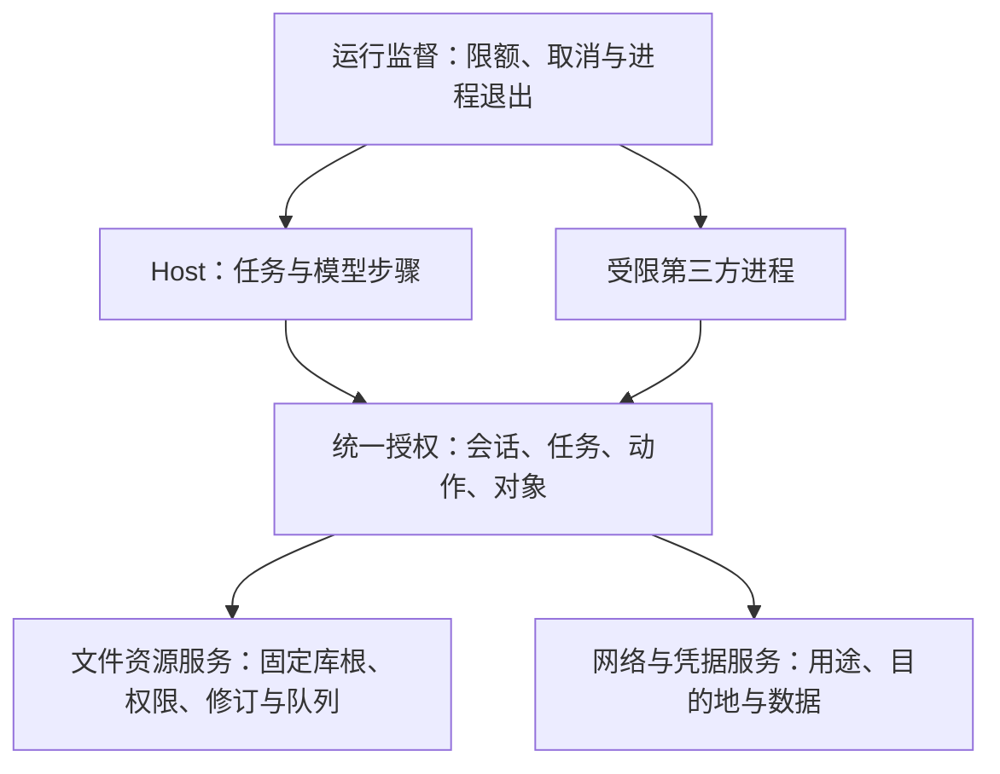

# 施工对象

本文不是围栏。合同见 [已拍板决定](decisions.md)。当前动手哪一刀见 [施工图](build.md)。

对象按工程题切。愿景 / 选型 / 路线已拍的写在下面；实现未锁的不装成合同。

| 对象 | 状态 |
|------|------|
| [Agent 核心框架](#agent-核心框架) | 已写 |
| [界面](#界面) | 已写 |
| [记录即正文](#记录即正文) | 已写 |
| [数据安全](#数据安全) | 已写 |
| [数据隔离](#数据隔离) | 已写 |
| [沙箱与任务授权](#沙箱与任务授权) | 单场授权与两项只读工具已接线；统一资源代理与第三方隔离未开 |
| [多进程 / 并发](#多进程--并发) | 已写 |
| [手动检索](#手动检索) | 已写 |
| [AI 检索](#ai-检索) | 已写 |
| [联网搜索与抓取](#联网搜索与抓取) | 已写 |

---

## Agent 核心框架

编码 Agent 入口是仓库根目录 `AGENTS.md`，不是本节。本节是产品里一场 `/` 的运行时。

### 功能愿景

Agent 不是侧栏聊天，也不是通用驾驶舱。人在当前这篇空段段首按 `/`，模型在这一篇正文里工作：口令留在稿上，回答先变成未采纳块，点头才跟手写一样。没密钥时笔记照常，只是 `/` 不可用。

一场 `/` 就是你一句、它一段。回车发送并散场，生成任务绑定发起时的笔记继续运行；切 tab 也散场，但不中断已提交的任务，结果仍回原笔记。关 tab 不取消；Esc、停止按钮、关窗或换库才取消相应任务。已写出的字仍是未采纳，并记中止原因。每篇最多一场运行任务，不同笔记可并行。

发挥模型：给它正文、同篇账本、这次 `/` 夹在哪两块之间，让它自己选工具、自己排步骤。应用不另做规划器。应用只组有预算的上下文、执行过门的工具、硬刹车、让人能核对。

合同见 [已拍板决定](decisions.md) §一场 `/`、§喂给模型、§工具、§壳与运行时。

### 技术选型

| 层 | 用 | 不用 |
|----|----|------|
| v0 宿主 | 主进程自建单 Agent 的 `AgentHost` | 当前阶段引入 LangGraph / Mastra / 多 Agent |
| 模型环 | Vercel AI SDK `streamText` + `tools` | 各家原生 SDK 各写一套 |
| MCP | 官方 TypeScript 客户端，经授权与资源代理；逐候选通过双平台出口验收 | 模型自己接；只凭白名单接入；直接继承主进程资源权限 |
| 到画布 | 现有 IPC | 渲染进程内嵌厂商 SDK |
| 密钥 | Electron `safeStorage` | 笔记库、仓库、明文占位 |

环：回车提交时把任务绑定到发起笔记与落点 → Host 组三样 → `streamText` 字回原笔记的未采纳块 → 未来工具请求经过统一任务授权，由受信任资源服务执行；第三方代码另在受限进程运行 → 观察回喂 → 明确取消或限额刹车。切 tab 不改变任务目标，不走人的 `noteWrite`。库内容、网页与 MCP 返回值均是低信任数据，不能提升为指令。

Host 最小环采用兼容接口 Provider 与 `streamText`，不给模型任何工具；加入 SDK 的具体版本以依赖锁文件为准。密钥由主进程加密保存，读取配置的 IPC 只返回非秘密字段和密钥保存状态。

### v0 上下文与历史

Host 以任务发起时的笔记和落点为边界，从同一文件分别读取正文与账本；正文的块编号、顺序和身份不从账本推断。每次组模型输入和执行工具前重新核验有效权限；名单无效、发起笔记禁止触碰或必须遵循时拒绝本篇 `/`，权限运行中变化后不得继续向模型流出旧上下文。**当前最小环**的历史只取本篇账本，不把别篇账本当作隐含记忆；未来人工确认的同库记忆须经独立来源与权限复核后才能加入，索引仍只吃正文。生成任务在模型步骤间保留本任务所需状态，散场不等于取消任务。

组装时使用模型设置中经验证的上下文窗口容量，为输出和估算误差预留保守预算（后续工具开放时也预留工具空间），再装当前口令与落点、落点附近和文首、尽量多的正文、近期账本原文。若正文与账本合计超限，较早的账本章节可按来源压成仅供本任务使用的摘要；仍装不下时才截断正文中间。不能静默丢掉本次口令或落点；连最小必要内容都放不下或无法确认可用预算时，不调用模型并说明原因。摘要调用也计入总时长和模型步骤；具体 token 预留与摘要算法可在验收中校准，不能靠固定字符数冒充模型上限。

摘要标明对应的原账本章节，只用于理解历史，不写回笔记或另建持久缓存，也不能替代精确引文。需要核对旧话时回读过门的原文；拿不到原文就说明不确定。笔记、账本、摘要、网页及 MCP 返回值均为低信任输入，不能变成上位指令。权限变化后，已组装的摘要不能绕过下一次出口检查。

### 实现路线

无日期。

- 最小环和库内 AI 工具分开交付，工具逐件过门；删除独立等待安全验收（清单见 [已拍板决定](decisions.md) §工具）
- 最小环无搜库工具
- 有限硬上限与设置可修改的合同见 [已拍板决定](decisions.md) §壳与运行时；超限和明确取消均停止后续工具，保留未采纳内容与原因

以下是各能力开放后的**初始工程默认值**，供固定验收样例和慢网测试校准，不是不可变的产品数字。按任务启动时已授权的工具集选档，并固定本次配置；可用联网或 MCP 时使用最后一档，是否实际调用它们不临时改档。并行工具各计一次，失败重试也计入调用次数。

| 可用能力 | 总时长 | 模型步骤 | 工具调用 |
|----------|-------:|---------:|---------:|
| Host 最小环，无工具 | 180 秒 | 4 | 0 |
| 本地工具 | 300 秒 | 12 | 24 |
| 联网或 MCP | 600 秒 | 20 | 40 |

「运行」页能修改这三档上限，主进程只接受有限正整数，总时长与模型步骤不能关闭，无工具档的工具调用数固定为零。任务启动时固定所属档与数值，运行中修改不追溯。联网搜索、抓页和 MCP 还须各有限时与有界重试，避免单个调用吃完整场；具体单工具数值在对应阶段经慢网和失败样例决定。

阶段顺序只维护在 [施工图](build.md#依赖顺序)：人的文件操作基础验收之后，先交统一任务授权与资源代理，再逐件开放对应 AI 文件工具；删除门只阻止删除能力。远端只读 MCP 优先，本机可执行组件接入前另过执行隔离门。读库／搜库仍在工具阶段开放，具体清单只见 [产品合同](decisions.md#工具)。本节不另维护一条省略安全前置的阶段链。

Host 与工具开放前，用虚构笔记库固定验收样例检查模型上下文、工具轨迹和最终文件状态：禁区不进模型、必须遵循不被写、其他笔记正文不被改、删除未确认不执行、恶意笔记文字不能提升为指令、明确取消后不再写盘；切 tab 或关 tab 后原任务继续且结果不串到新 tab。长正文与长账本同时超限时核对落点、旧章来源和账本原文不变；摘要遗漏细节时不能补造，权限中途变化后旧摘要不能继续流出。对超时、网络失败和重试也核对原因记录与限额。同篇第二场须被拒绝，异篇任务可并行，关窗或换库须先取消受影响任务并保存未采纳内容及中止原因。

### 后续 Agent 能力

这些是要继续讨论并落实的能力，不属于 v0 当前一场 `/`，也不因预留路线而自动开放。它们仍须服务当前笔记与库内工作；具体交互、实现和阶段顺序在各自开工前改产品合同、施工图与 `AGENTS.md`。

| 能力 | 要解决的事 | 开放前必须拍板和验收 |
|------|------------|----------------------|
| 多轮历史管理 | 从多次 `/` 的账本章节中准确选择、压缩、核对相关历史 | 连续交互是否及如何出现；旧话来源、遗漏与更正如何呈现 |
| 库内人工记忆 | 人从正文或账本明确选取并确认，供同库后续任务引用 | 已定边界见 [产品合同](decisions.md#助手记忆与连接未来合同当前未开放)；待施工来源身份、权限失效和召回的工程门 |
| 子代理委派 | 将有边界的子任务交给受控执行者 | 权限继承、取消传播、工具出口、成本与步骤上限、结果核对 |
| 多代理编排 | 协调多个受控任务而不丢稿或越权 | 并发写入、任务归属、失败恢复、总预算与可审计轨迹 |

任何后续能力都不能绕过原文来源、每次出口的权限检查和任务硬刹车。多代理不等于通用 Agent 驾驶舱，也不自动开启独立聊天区或无人值守扫库。

### 助手、库内记忆与多连接的待施工问题

这些是 [产品合同](decisions.md#助手记忆与连接未来合同当前未开放) 已定规则的工程问题；**当前阶段不实现**。下一刀开放前须在 [施工图交接表](build.md#跨能力交接) 写清接口、测试和窗口证据。

| 工程题 | 需解的问题与失败关闭条件 | 定向验收 |
|--------|--------------------------|----------|
| 来源身份与迁移 | 记忆保存时绑定库和正文范围或账本章的稳定身份与内容指纹；结构操作后以对象身份迁移来源，不能凭路径猜测。来源修改、删除、权限收紧或身份无法核对时暂停使用，人工复核流程及恢复状态须定型。 | 改正文、改账本、改名、移动、删除、权限变更、未完成生命周期记录和跨库同名文件均不误召回。 |
| 人工记住与删除 | 从明确选区或账本章生成可编辑预览，确认后写入受控隐藏记录；记录只存必要内容和来源，不落进笔记正文或搜索索引。删除操作及中断恢复要有可核对结果；模型没有写入口。 | 未确认不保存，修改预览不改来源，删除后不再召回；损坏记录和写盘失败显错。 |
| 召回与任务上下文 | 相关项的选择、排序、容量预算及实际使用项记录与正文和账本共用预算；入模前重核库、来源、有效权限和本场读取范围，核对模型接收方。低信任记忆不得升级为指令，外部发送另获批准。 | 长文、多记忆、范围外来源、瞬间变化、权限收紧、同名不同库及重试均不串用；账本可核对实际用项，拒绝发送不发请求。 |
| 连接与凭据 | 多连接的稳定 ID、配置版本、密钥密文归属和迁移旧单配置的方法待定；读取 IPC 不回传秘密。带密钥的请求不得借端点或重定向切到另一连接。 | 两个连接反复切换／删除／重启／并行任务，错误与保存失败不串密钥、不静默回退。 |
| 单场模型快照 | 设备默认模型与任务临时覆盖在启动时合成不可变快照；连接被编辑或删除后的在途任务处理须定型，失败原因可见。 | 默认与覆盖并行、启动后改配置、供应商故障、取消与重试，任务归属和模型记录始终一致。 |
| 可信用量记录 | 仅在供应商提供可核对的用量字段时按连接／模型／任务聚合，标明估算与真实值；不存提示全文、密钥或回答来做统计。 | 缺字段、重复事件、流中止、不同供应商口径和重试不重算为真实用量。 |

摘要模型、视觉辅助模型、搜索服务等模型分工，只在对应能力已开放且请求边界、成本与可用性有证据后逐项设计；不因另一个产品的设置截图预置控件。

---

## 界面

呈现规则是围栏（[前端协议](../docs/frontend.md)）；本节只记工程上怎么组织，不重复产品行为。

### 功能愿景

画布安静、导航清楚、控件可辨：正文是主角，工具只在需要时出现。日夜两套值一起设计，不是把日间反相。

### 技术选型

- **token 分两层**：先按语义角色命名（`--surface-canvas`、`--text-body`、`--ai-prompt`…），再让组件引用角色；日夜两套只写在 `:root` 与 `[data-theme='night']` 两段。取值用纯 hex，测试可以直接解析算对比度，不用起浏览器。
- **主题来源**：主进程在创建窗口前读取本机应用数据目录中的日间／夜间／跟随系统偏好，设置 Electron `nativeTheme.themeSource`；渲染层读实际生效的 `matchMedia('(prefers-color-scheme: dark)')` 写 `documentElement.dataset.theme`，并重配置 CM6 的 `darkTheme` facet。偏好不进笔记库，切换不产生文档事务；写偏好失败保留原选项。
- **编辑器颜色走 token**：CM6 主题、标题/装饰类名都引用 token；mermaid 的 SVG 自带主题，靠**主题切换时重建装饰**让它重渲染；KaTeX 随 CSS 变色，不用重渲染。
- **显示层与内容分离**：提问的 `>` 前缀与回答缩进由装饰/类名产生，绝不写进文件；判断依据是 `composeSource` 往返逐字节不变。
- **浮层用一个原语**：`<dialog>` + `showModal()` 拿到焦点containment与 Esc，外面包一层模块级栈（同时最多一个模态、关闭回到触发元素）。搜索、冲突决策、选库共用；选库是唯一不可 Esc 关闭的。
- **冲突双预览的 diff**：先按行做 LCS 对齐，**再成对归并**——纯 LCS 会把「改了一行」拆成「删一行 + 加一行」，两栏预览就看不出 `v1 → v2` 的对照；然后变化行内按字符细化（中文没有词边界，按词切会切坏语义）；只渲染变化处附近的上下文，长段折叠成「省略 N 行」，变化簇过多时报出剩余处数；超大输入走退化路径（不做 DP）。默认上限（6 个变化簇、上下各 2 行、单行 240 字）是阶段默认值，可调。纯函数，单测覆盖。
- **标题索引**：数据直接吃 `DocIndex.headings` 的 h1–h3；当前项的判据是**光标在可视范围内时以光标为准，否则以视口起点为准**——只看视口会指错（点完一节，视口顶部常停在这一节的末尾，实测点「章节5」显示「章节4」）；点击既滚动也把光标放过去，用 `EditorView.scrollIntoView`。
- **CM6 与样式的作用顺序**：CM6 的基础主题是运行时注入的，同优先级的行类规则（如 `.rgent-block-ai` 上的 `padding-left`）会被它的 `.cm-line` 盖掉，要用 `.cm-line.xxx` 提优先级；相对缩进还要自己抵掉它那层 6px padding，否则写 `1em` 只有 11px。
- **字数口径（阶段默认值，不是产品数字）**：CJK 逐字计 1，拉丁字母与数字的连续串计 1，只计正文（不含账本与身份标记行）。要精确到别的口径时先改围栏。
- **阶段边界**：底栏字数只在渲染层计算；主进程人搜与 Markdown 管线保持原实现，不为界面施工新增跨层取词模块。因此「标记不进语料」这件事现在有两份实现——主进程 `src/main/vault-index.ts` 的 `blankMarkers` 与渲染层 `src/renderer/src/statusbar.ts` 的 `wordsOf`（口径一致，都是等长跳过标记范围）；**改口径要两处一起改**。要合回去就从 `src/markdown/` 抽纯函数，但那属于索引那一刀的授权。
- **DOM 测试**：`jsdom@30` 进依赖后，widget 级测试（callout / table / wikilink / safe-html / read-only）用文件级 `// @vitest-environment jsdom` 跑在 `pnpm test` 里；窗口级规则（焦点归属、Esc、浮层栈、真实布局）用 `scripts/verify-ui.mjs`（`pnpm ui:check`）在真实窗口里验，**CI 的 macOS 与 Windows 两腿都会跑**——这两层互补，不要互相替代。
- **键盘**：window 级一层映射表（⌘K 搜索、⌘S 保存），编辑器内的 `Mod-s` 移出去以免双触发；⌘F 只保留键位，篇内查找的界面未定，等后续一刀。

### 实现路线

token → 壳结构（树、tab、底栏）→ 标题索引与快捷键 → 浮层与搜索 → 画布呈现（`>` 前缀、回答缩进、动作层级）→ 冲突双预览 → 可访问性收口（对比度、焦点态、窄窗、减少动效）。

验收在 `800×560` 与 `1200×800`、日/夜、长文、多 tab、长文件名下各走一遍；真实窗口用 CDP 脚本驱动（`scripts/verify-ui.mjs`），脚本在 CI 的 macOS 与 Windows 两腿都跑。CI runner 的虚拟显示器会把窗口夹到 1024 上下，所以脚本把「窗口尺寸」与「1200×800 布局」分开验：前者只卡下限 `800×560`，后者用设备度量模拟，与屏幕无关。

---

## 记录即正文

编码 Agent 入口是仓库根目录 `AGENTS.md`，不是本节。本节是「一段有三种身份」这件事怎么落地。

### 功能愿景

正文既是成品稿，也是记录本身：你写的字、还没采纳的 AI 块、你的口令，都留在同一个文件里，关掉再打开还在。别的编辑器看到的是同一批文件，内容不丢也不脏。

### 技术选型

- **标记形式**（围栏已拍）：被标块前一行一枚整行 HTML 注释，无闭合。选它的实测依据：注释天然落成 mdast 的 `html` 节点，一条 mdast 变换就能消费，**不新增 micromark 语法**；AI 内容仍是普通 Markdown，标题、公式、`[[链接]]` 走同一条管线；漏一枚只影响一个块。对照：围栏式（` ```rgent-ai `）实测把整段折成一个 `code` 块，里面的 Markdown 不再编译——要显示就得再解析一遍，直接撞「不要在画布 / 检索 / Agent 里再各写一套」，否决。
- **身份怎么进索引**：变换把身份写进**被标块**的 mdast 节点 `data`，`buildIndex` 读它。缺省即人写的，只有例外才挂字段——与「默认可参考不挂徽章」同一个取舍。
- **标记不是块**：变换把标记节点从树上摘掉，所以它不进块清单、也不产生装饰；画布上由渲染层把它藏起来（零宽 widget），而不是让管线假装它不存在。
- **采纳 / 丢弃**：采纳 = 删掉标记那一行；丢弃 = 删标记行 + 它标的块。两者都表达成普通的事务变更，不留隐藏状态。
- **未采纳块不能改字**：CM6 没有「局部只读」原语，用 `EditorState.transactionFilter` **默认拦下所有改文档的事务**，只放行带 `rgent` 前缀 userEvent 的自家动作。只认 `input` / `delete` 会被 Alt-上下移行、拖动搬字、Ctrl-T 换位整批绕过（实测 Ctrl-T 能把 AI 块里的字换位）。**不许**用 `editable = false` 或整篇 `readOnly` 冒充——那会连人的正文一起锁住。
- **锁定与段落语义相撞的两处，各有对策**：Markdown 里相邻两行同段，所以（一）在锁定块**下面那行**打字会把新字并进那块、随后被锁住——对策是在那个位置插入前先补一个断段符，并同步右移光标；（二）整块删掉未采纳块时标记行会留下、就近标到下一段人写的字上——对策是删块时把标记一起删。
- **防错方向（已定，供复核）**：损坏的标记按「不是标记」处理，那些字照旧留在正文里看得见（不静默吞掉）；伪造的标记确实会锁住它标的那段，逃生口是 chip 上的「删标记」。反过来做（残缺注释也进锁定）会让一个错别字锁住用户自己的正文，代价更大。
- **拖动是搬家**：只允许落在段落之间，落点按块边界判定，不按像素。v0 用「上移 / 下移」这类显式命令即可满足「拖只换位置」；指针拖拽的手感等交互像素那一刀再定。
- **画布装饰的来源**：编译结果与装饰由一个 `StateField` 提供。CM6 只允许**静态**装饰源产生块装饰，`ViewPlugin` 提供的一律抛 `RangeError`——表格 / callout / mermaid / 块级公式因此曾经整类打不开。顺带一个实测结论：块级替换会吞掉紧随其后的行装饰，所以身份标记的 chip 用行内替换、只覆盖注释本身。
- **账本只读视图**：入口固定在正文画布右上角，同一笔记 tab 内临时切到只读视图，内容直接来自 `partitionSource` 的 `ledger` 段；不新增第二份解析或 tab，也不占右侧反链。

### 实现路线

先管线（读标记 → `DocIndex` 带身份 → `composeSource` 往返不变形），再画布（藏标记行、两种样子、采纳 / 丢弃、拒改），最后账本只读视图。

身份标记阶段先用手写账本验证只读回顾；当前 Host 最小环已接入按任务写入方。围栏把只读回顾排在写入之前，这一依赖顺序保持不变。

早晚要动的地方：技能阶段要往注释里加技能名，属性键名仍未锁；块编号永远不落盘，掉出本次打开就重排。

---

## 数据安全

### 功能愿景

库是磁盘上的明文 Markdown，不当保险箱、不另做加密层。要防：渲染进程乱摸盘、密钥进库或进 git、媒体/符号链接逃出库根、页面乱跳，以及抓回来的网页冒充系统提示。模型不可信。

### 技术选型

| 要防 | 用 | 不用 |
|------|----|------|
| 渲染进程摸盘 | `sandbox` + `contextIsolation` + preload 白名单 | `nodeIntegration` |
| 乱开页 | 拒绝 `window.open`；`will-navigate` 拦下，http(s) 走系统浏览器 | 内嵌第二套浏览器 |
| 脚本 | CSP：`default-src 'self'`；图允许 `data:`、`rgent-vault:` 与受控 `rgent-image:` | 随意 `unsafe-eval`、渲染层通用 HTTP/HTTPS |
| 媒体逃出库 | `resolveInVault` 的词法拒绝 + `SecureVaultFs` 固定库根句柄读取 | 只凭 `realpath` 预检后再按可变路径读取 |
| 密钥 | Electron `safeStorage` | `.env`、笔记文件夹、仓库 |
| 网页回灌 | 纯文本 / Markdown 摘录，当不可信 | HTML/当系统提示 |

壳加固已在代码里。强制点见 [架构](architecture.md)。renderer sandbox 保护界面进程；主进程中的 Host 尚无第三方执行隔离，不能把界面隔离或 CSP 写成完整 Agent 沙箱的交付证据。后续安全前置见 [沙箱与任务授权](#沙箱与任务授权)。

### 实现路线

Host 最小环同时接上 `safeStorage`，密文只存应用数据目录；发行前分别验证 macOS 签名后读取与 Windows DPAPI。抓页清洗跟联网那一刀。

---

## 数据隔离

### 功能愿景

门禁挡模型，不挡人。人能打开、能搜到禁止触碰。模型检索没有禁区，`/` 碰不到，代转也带不走。必须遵循人能改、模型不能写。一份全量语料，查询期过滤，不建「看不见」索引。

### 技术选型

| 问题 | 用 | 不用 |
|------|----|------|
| 名单 | 库根 `.rgent-permissions`（架构选定值） | 写进正文；走 `noteWrite` |
| 谁改 | 人：树右键（已交）/ 设置总表（以后）。主进程专用 IO | 模型工具 |
| 跟随 | 文件夹 → 子路径；笔记 → 同名附件夹。更长条目优先 | 建索引时抹禁区 |
| 执行点 | 人的读/搜不看档。进模型的出口都看 `tierFor` | 人搜也滤禁区 |

条目格式（JSON）只在 [施工图](build.md)，未进围栏。

### 实现路线

门禁阶段已把名单做成 `ready(entries)` / `invalid(error)` 与纯函数 `tierFor`。缺文件是空名单；已有文件损坏或不可读时保留原文件，人读写搜继续，AI 出口全部拒绝。现有无工具 Host 在模型请求及独立写回前复核有效权限；未来工具还须叠加 [任务授权](#沙箱与任务授权)，不能把 `tierFor` 单独当作完整授权，也不能只用启动时缓存。

---

## 沙箱与任务授权

### 目标与当前证据

产品边界见 [沙箱合同](decisions.md#沙箱与单场任务授权合同与开放边界)。本节区分已有单场授权与后续代理／第三方隔离；后续未开部分不是当前施工授权；阶段入口仍见 [施工图](build.md#当前阶段)。

需要同时阻止两类行为：模型受恶意笔记或工具结果诱导而提出越权操作；第三方程序绕开工具入口直接读盘、联网、读取凭据或另起进程。权限校验与操作系统隔离分别承担这两项职责，任何一层单独成立都不足以证明另一层。

已有基础是 renderer 隔离、类型化 IPC、主进程秘密存储、固定库根 IO、库内队列、权限复核及生命周期恢复；现有 Host 单场范围与模型接收方授权已验收；统一第三方资源代理和可执行第三方隔离未交。主进程与其中的可信服务属于受信任计算基础，须缩小可调用表面并核验每个请求。当前不承诺防住管理员／内核或应用之外的恶意进程，也不提高已有文件竞态的保证强度。

这里的隔离对象是拟接入的 MCP 服务器、扩展或外部可执行主体，不能把它们的返回值或 IPC 当成可信请求。已随主应用加载的核心依赖仍属于受信任计算基础，须审定版本和最小权限；本方案不宣称能隔离已经在高权限主进程执行的任意恶意依赖，需要执行不可信代码时必须移到可证明受限的主体。

### 目标数据流与职责

以下是规划图，不能作为架构已接线证据：



职责先落到现有主进程接口和安全原语，不预设六个新服务、仓库或运行时。库内工具清单仍只在 [产品合同](decisions.md#工具) 维护，外部 MCP 能力逐项审定，沙箱管理本身不增加模型工具。

| 职责 | 消费的已有能力 | 须交给下游的行为与证据 |
|------|----------------|--------------------------|
| 统一授权 | `AgentHost` 任务身份、`VaultSession` 会话、权限复核、类型化 IPC | 主进程签发且可撤销的授权；请求须绑定实际调用主体及受控通道，不能凭组件自报的任务 ID、路径或令牌认定身份。核对动作、来源／目标及授权版本，人的入口不作为模型能力暴露，拒绝伪造／重放及失效请求。 |
| 文件资源服务 | `SecureVaultFs`、库内队列、生命周期预览／提交和恢复 | 执行前及队列排到时重核；授权不替代对象、权限、完整子树和修订检查。不接收任意绝对路径，不借引用修复改其他篇正文。 |
| 网络与凭据服务 | 模型配置、`safeStorage`、受控图片通道 | 区分读取范围、选定模型接收方和外部发送确认，批准绑定实际内容、目的地、用途及任务；改变后重新确认。凭据按连接只用于指定服务认证，不作模型内容、不交本机服务器环境。核验重定向、限时、体积、域名和实际目标地址；本机模型授权不等于通用回环／内网访问权。限制原始 socket、Node 网络 API 及其他绕行出口，不能只代理某个 HTTP 客户端。 |
| 隔离执行环境 | 现有进程与签名／构建体系；平台路线待验证 | 最小文件权限、无通用网络、无秘密环境变量、受控进程创建；子孙进程不能获得更大权限。白名单绑定实际程序、版本／内容与启动参数，变更后重新验证。 |
| 运行监督 | 有限任务上限、取消、Host 保存与收尾 | 给执行组件补 CPU、内存、进程数、输出和临时空间的有界预算；同任务的重试、并行调用与子孙进程共用总预算，不能靠重新拉起组件重置。到期／撤销／崩溃后不再受理新副作用，取消覆盖子进程，保留已产出的内容与逐项结果。具体限额经压测确定。 |
| 可核验记录 | 任务账本、生命周期逐项结果 | 人能核对范围授权、扩展／撤销、调用及拒绝、部分失败；模型只接收获准的结果。过滤秘密、原始环境、禁区内容及错误中的路径信息，不记思维链，不另建全文审计库或快照。 |

确需临时文件时，使用任务专属空间，只放经过门禁的必要材料；不复制整个库或全量人搜索引。复用既有取消／退出／重启清理流程，仅清理能证明由应用创建和归属的对象；临时目录本身不构成隔离证明。

第三方工具逐项声明动作、参数与结果的数据来源及所需资源，再映射到受控能力；不能开一个通用 MCP 调用入口透传任意工具名、绝对路径、目标 URL 或凭据。服务器的自述和工具 schema 是待核输入，不构成授权证明。工具列表、程序内容或配置改变后重新审定；未识别的新工具默认拒绝。协议适配只转换格式，不扩大能力或绕过任务预算。

### 单场授权的生命周期

1. **建立**：绑定库会话、任务和发起篇；默认读取发起篇正文及本篇账本，附件或其他笔记／目录须明确授予读取范围，并与最新三档权限取交集。新建目标与跨篇结构范围另由人明确授予，默认无授权。现有 Host 已接一次性范围预览与接收方确认，当前只开放固定笔记集合的读库／搜库；附件、结构授权及其他出口仍未开。
2. **展示并确认**：给人看读取对象及本场选定的模型接收方；云端端点意味着内容发送给对应供应商，不能仅显示“本地读库”。结构动作另展示来源、目标、附件与影响，人可指定范围连续操作；未存在的目标绑定已核验父目录与命名范围，并检查目标显式规则。对搜索／抓页／MCP 的发送另展示实际内容、目的地、用途，读取和结构授权不能代替这次批准。
3. **执行**：每次调用在排队前、真正执行前核对授权有效性和最新对象状态；目录需完整枚举子树，成员变化使原预览失效。其他任务、人稿或外部修改造成身份变化时，只有通过现有保存／迁移路径核验的身份续接可更新绑定，外部替身不能继承；无法确认就暂停并重新预览。合法改名／移动后的新路径仍核对原先获准的来源、目标及动作边界，不因路径续接、移入目录或新建对象而自动获得更多正文写入权；重启或恢复记录不能复活已结束任务的授权。
4. **扩展与撤销**：模型仅提出扩展请求，只有人能确认；操作种类、对象或目标超出已授范围就停止该操作。用户撤销、权限收紧和库会话改变使后续调用失效，挂起的授权对话框及迟到结果也核验会话与授权版本。删除的逐次确认单独保留。
5. **收尾**：取消或任务结束不再接受新调用；已经开始的不可中断系统操作仍须核对并报告真实结果，不能假称撤销已生效或自动回滚。可信服务为保全已有内容进行收尾保存、账本记录及清理，仍遵守最新权限、身份、修订和冲突边界；无法写回时保留待保存内容，不借收尾调用新工具。中断恢复按已有记录核验，恢复记录不赋予模型继续操作的权限。

数据在读取、摘要、暂存、组装请求和返回结果之间保留可核验的来源关联。正文、账本、记忆及其摘要适用相同读取与发送边界；选择记忆须核对其来源是否在本场范围，不能以隐藏副本扩大读取。发送前重核来源状态及允许的用途；权限收紧或来源失效时，相关缓存和派生结果不得作为后续请求的有效材料，正在生成的旧结果也不能继续据此触发工具。已发送的数据无法由本地撤销追回；记录实际已发送／尚未发送和中止结果，不假称对方已经删除。具体来源记录和缓存失效实现待施工验证。

初期对受本地上下文影响的外部请求采用实际发送内容确认。模型见过本地材料后产生的自由文本，不能靠关键词判为“通用／不敏感”；不能证明只来自已批准发送材料就要求人确认。批准仅在本任务、来源仍有效且内容／目的地／用途未变时覆盖有限重试；参数重组、重定向到新接收方、目的改变均不得借旧批准发送。确认的是必要业务数据，不包含连接认证密钥；具体预览格式与批准绑定方式待工程验证。

### 平台候选与接入边界

Electron 的 [renderer sandbox](https://www.electronjs.org/docs/latest/tutorial/sandbox) 限制渲染进程；[utilityProcess](https://www.electronjs.org/docs/latest/api/utility-process) 是带 Node 能力的子进程。**独立进程、设定 `cwd`、过滤环境变量、stdio 通信或 SDK 白名单本身都不能证明文件与网络已隔离。**

| 平台／接入方式 | 研究候选与必须取得的证据 |
|---------------|---------------------------|
| macOS 本机组件 | 研究 [App Sandbox 与 helper](https://developer.apple.com/documentation/security/protecting-user-data-with-app-sandbox) 等可支持路线；核验签名后的真实可执行文件、权限继承、动态文件授权和子进程行为。不要把主应用选择的整个库或秘密权限直接继承给 helper。 |
| Windows 本机组件 | 研究 [AppContainer／LPAC](https://learn.microsoft.com/en-us/windows/win32/secauthz/implementing-an-appcontainer) 等候选；核验实际 token／文件与网络权限、子进程及资源限额。仅隔开进程或限制寿命不能证明资源边界。 |
| 远端 MCP（首批） | 仅审定 HTTPS 的只读查询／资料获取，不下载或启动服务器代码、不直接挂库。验证 macOS／Windows 本地受控传输、目标认证、逐项参数与数据发送、凭据归属、结果来源、超时／取消和部分失败；需要无法代转访问或不能证明本地出口受控的候选拒绝。本机隔离不约束远端内部，远端保留数据或内部行为不能被假称已隔离。 |

这些只作为研究候选。实际支持的系统版本、分发签名、原生适配与库依赖开工前写清，不提前锁实现。TypeScript 无法提供所需 OS 强制点时，按 [原生安全边界例外](decisions.md#壳与运行时) 使用最小平台适配；不引入 Shell 或通用代码执行能力。某种启动／签名方式失效时该组件保持关闭，不能普通启动补位。

接入次序是远端只读 MCP 优先、本机可执行 MCP 后置。[MCP 传输规范](https://modelcontextprotocol.io/specification/2026-07-28/basic/transports)同时描述 stdio 与 Streamable HTTP，传输名称本身不构成安全证明；远端候选只使用经验证的受控 HTTPS 路线。官方协议客户端作为核心依赖审定版本与调用表面；本机服务器程序才适用 OS 执行隔离。外部写入、发送消息、发布及账号修改不在首批范围，须另讨论能力与副作用，不能由工具发现自动开放。

### 两道开放门与定向验收

**门一：统一任务授权与资源代理。** 在 AI 文件工具和受控外部能力接线前交付，复用已验收的人的文件操作基础；删除单独等待废纸篓门。读库／搜库的结果及元数据按本场读取范围与最新权限过滤；向选定模型、搜索或 MCP 发送分别核对，不等于已经通过第三方执行隔离。

**门二：第三方执行隔离。** 在首个本机可执行第三方组件接线前取得机制依据与 macOS、Windows 实测。远端只读 MCP 不需先启动本机服务器或等待该执行门，但仍逐候选取得两平台本地出口证据；本机组件核实际程序版本、启动方式与全部资源边界。基础隔离通过不使所有服务器自动获准，远端内部也不能假称已核验。内置联网独立验收，不因 MCP 门通过而开放。

| 验收组 | 关键反例与通过证据 |
|--------|--------------------|
| 范围授权 | 默认只读发起篇／本篇账本；其他笔记、附件、路径信息与搜索结果范围外不返回模型，人搜全库不受影响。读取扩展不能由模型批准；结构操作来源／目标另授权，合法路径续接不扩权，未存在目标显式规则仍有效；删除工具未过独立门不注册，通过后仍每次确认。 |
| 权限与身份 | 禁区与只读不被范围授权放宽；伪造任务／令牌／调用主体、同路径替身、目录成员变化、旧预览、换库迟到结果均被拒；合法应用写盘身份续接可核对。 |
| 并行与恢复 | A 的授权不能被 B 复用；人的保存、Host、结构队列交错不丢稿。权限收紧、取消与限额后无新工具副作用；重试、并行调用及子孙进程不能重置总预算。在途操作和部分失败如实报告，中断记录不被清空，收尾写回受阻仍保住内容，重启不复活旧授权。 |
| 数据与出口 | 笔记／技能／记忆／网页注入不能扩权；权限收紧后，失效来源的缓存、摘要和工具结果不再发送或触发新工具，已发请求如实标记并尝试中止。未知工具和任意参数透传被拒；联网关闸阻止搜索／抓页和 MCP，模型文本和图片分别核验；DNS／重定向／回环地址不能借用途授权扩大访问，跨连接、错误与日志不泄密。 |
| 直接越权 | 专用恶意测试组件尝试读库外与禁区、写库、读密钥、借链接／重解析点和继承句柄逃逸、原始网络访问及派生进程；macOS、Windows 的构建后组件均实际被阻止，含失败／崩溃和取消场景。不能只验证正常 SDK 调用。 |
| 授权交互 | 真实窗口核对范围和目标可辨、确认／拒绝／撤销、键盘焦点、陈旧预览与部分失败提示；没有解除安全限制或强制执行入口。 |
| 发送确认 | 云端模型接收方可辨；读库批准不能用于搜索或 MCP。模型转述、摘要与记忆均核来源与实际发送内容；拒绝或未确认不请求。同内容／目的地／用途的有限重试可复用有效批准，任一变化、来源失效或换库均重新核验，不靠关键词免确认。 |
| MCP 分层 | 两平台受控 HTTPS 只读查询及失败／取消可核验，不挂库、不下载服务器；凭据仅认证指定连接，日志／模型内容不含密钥。新发现工具不自动可用，外部写入不开放；本机候选没过执行隔离就不启动，也不影响已独立过门的远端能力。 |

只测专用临时库、本地受控服务和虚构凭据。证据分别记录机制说明、测试条件／版本、双平台 CI、构建后原生进程与真实窗口结果；缺一项标待核，失败保留反例并关闭对应能力。最终门禁写回 [施工图](build.md#跨能力交接)，不按测试数量、单平台成功或 CI 绿灯宣称全体系通过。

待定工程项集中在授权格式与交互、对象合法续接、排队期间撤销、临时空间与审计保留、平台机制／签名和数值预算；它们不削弱已经确认的产品原则，也不作为本轮代码任务。

---

## 多进程 / 并发

### 功能愿景

画布不能去碰盘、跑模型、建索引。打字、自动写盘、监听、退出 flush、以后流式写未采纳块，不能互相丢稿或卡死窗口。不多库并行，不把索引做成独立服务。

### 技术选型

| 问题 | 用 | 不用 |
|------|----|------|
| 进程 | 当前可信索引、Host 和两项只读工具在主进程；性能迁移与第三方安全隔离分别评估 | Python 边车；把普通子进程当作已完成沙箱 |
| 通道 | `shared/ipc.ts` | 渲染进程自己开网、读盘 |
| 索引 | 惰性全量，查询时重建；打字不触发 | 按键增量（现在不需要） |
| 退出 | 先 flush，`will-quit` 才 `dispose` | `before-quit` 先拆库 |

主进程重建索引若使输入或取消响应不达标，应调整执行位置；当前布置不是产品性格。第三方可执行组件即使性能达标，也须在接入前通过 [执行隔离门](#沙箱与任务授权)，不等待性能压测触发迁移。文件门禁与凭据管理仍留在受信任服务，组件不能直接继承人的访问权限。

### 实现路线

笔记同目录原子替换、内容修订值、同篇应用内串行写、外部修改冲突交给人选磁盘或窗口稿、退出保存失败的三条出路（重试 / 继续编辑 / 放弃并退出），都已交，见 [施工图](build.md) 的门禁一节。现有 Host 取消用 `AbortSignal` 覆盖 Esc、停止按钮和关窗，流式回画布走 IPC；切 tab 仅结束输入交互，不发取消信号。未来执行组件还须接续任务取消、资源限制与子进程退出，不能仅中止模型 HTTP 请求。

---

## 手动检索

### 功能愿景

没密钥也能搜标题和正文句子。禁止触碰搜得到。账本搜不到。

### 技术选型

当前工程选型是惰性全量重建 + 标题与正文子串（大小写不敏感）。可按压测调整引擎；人的全量可见与只吃 `partition.body` 是合同。主进程搜，渲染进程只展示。最多 100 条、排序、片段规则未写成围栏数字。

向量检索是非目标。

### 实现路线

人搜已可跑，门禁落地后仍然不过滤禁区。换引擎要等压测结论另开一刀，不要顺手在身份标记那一刀里做。

---

## AI 检索

### 功能愿景

模型和人查同一份语料；模型只见本场读取范围与最新权限允许的内容和路径信息，人仍可搜全库包括禁止触碰。返回可引用片段，好兑现「必须按原文 / 可抽查」。不是向量检索。

### 技术选型

同一份 `VaultIndex`（只吃正文）。查询期核对有效权限与本场读取范围，返回前重核来源；不能先把全库文件名或片段给模型再过滤。**方法不与人搜子串绑定**；倒排 / BM25 / 按块切未锁。合同是「带路径的可引用片段」，不是「子串扫描」。

「软件可抽查是否真检索、引用」方法仍未锁。

### 实现路线

晚于门禁。Host 最小环不做搜库工具。工具那一刀再上搜库。实现可以先朴素，换引擎不改性格。

---

## 联网搜索与抓取

### 功能愿景

专业问题可以由模型提出：先查本地（本场读取范围与门禁内），不够再请求上网。应用级总闸和数据发送批准均须成立；受本地上下文影响的请求让人确认内容、目的地和用途，不能默认带出相关片段。禁区不经代转带出。抓回网页当不可信，进模型只准纯文本 / Markdown 摘录。不是第二套浏览器，不是模型自己 `fetch`。

### 技术选型

未来内置工具经 [统一授权与资源代理](#沙箱与任务授权)，过联网总闸、任务读取范围、发送批准、任务限制、来源权限和目的地校验。搜索引擎、抽正文库、超时体积未锁。关闸时搜索／抓页与 MCP 不发请求；已配置模型文本与笔记图片各按独立用途核验。远端 MCP 核两平台本地受控出口，本机服务器另过执行隔离门，不能凭 SDK 代转或白名单假定 socket 已受控。

### 实现路线

最小环已调用模型文本接口，尚无 Agent 联网搜索／抓页。本地工具、统一资源代理和相应出口门之后再做，总闸 UI 与 `safeStorage` 是前置。先锁出口和回灌形态，再选供应商；平台执行隔离只在接可执行第三方时成为强制前置，不能把它当作任意开放网络的许可。

相关：[施工图](build.md) · [架构](architecture.md) · [已拍板决定](decisions.md)

## 单场只读工具施工

本轮先验授权再接工具，见 [当前施工阶段](build.md#当前阶段)。目录选项固定展开对象，预览与消费绑定会话、调用方和配置；失效拒绝、重播拒绝，合法自身保存只续接身份，不扩权。

来源依赖覆盖工具结果、搜索片段、消息、临时摘要及历史任务章；每次返回／发送前重核，不能靠缓存或本篇历史副本绕过外篇权限。分页以正文块和来源标识定位，隐藏路径／外篇账本拒绝，截断明确说明。模型调用适配为单步事件，Host 接管工具循环、顺序、取消与统一预算；不新增依赖，不自动执行 SDK 工具。

验收分别覆盖伪造／串场／旧预览／配置变化、范围外零返回、范围内命中不被范围外挤掉、分页和坏语法、分片工具参数／未知工具／多调用、读取及下一次发送间来源变化、历史依赖变禁区、取消后零请求、保稿和另存。真实厂商无测试密钥时仍待核。工具包通过后当前阶段保留「库内 AI 工具」，写工具及其他能力未开。
